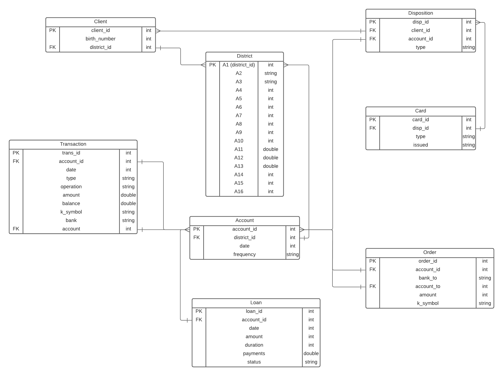
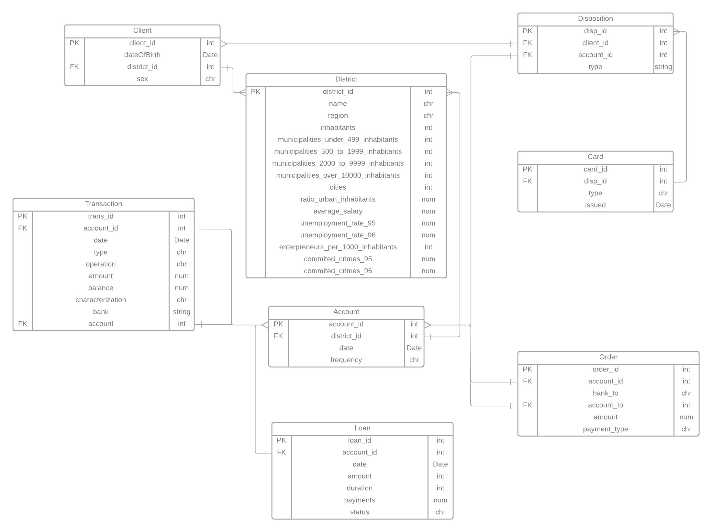

```{r setup, include=FALSE}
knitr::opts_chunk$set(echo = TRUE, eval = TRUE, message = FALSE,
                      warning = FALSE)
```

```{=html}
<style type="text/css" media="screen">
h1, h2, h3 {
    color: #4D4D4D;
   }

.list-group-item.active {
    background-color: #FDE70F;
    border-color: #FDE70F;
    color: #4D4D4D;
    font-weight: bold;
}

#logo {
    padding-left: 1rem;
}

</style>
```
## Aufgabenstellung

### Allgemein

[^1]Eine tschechische Bank möchte ihre Dienstleistungen für Privatkunden
verbessern und "interessante Kundengruppen" identifizieren. Die
Geschäftsleitung hat keine präzise Vorstellung, möchte aber zusätzliches
Business generieren ohne unnötige Risiken einzugehen und Verluste
einzufahren.

[^1]: Erstellt von Aaron Studer

Der analytische Auftrag umfasst die folgenden Aufgaben:

-   Qualität und Repräsentativität der Daten zu überprüfen
-   Die Verteilung der einzelnen Datenattribute zu erheben
-   Deren Veränderung über die Zeit zu analysieren
-   Korrelationen zwischen verschiedenen Datenattributen zu
    quantifizieren und zu visualisieren sowie Hypothesen hinsichtlich
    optimaler Produktverkauf / -nutzung zu erstellen

### Datengrundlage

[^2]Wir erhalten die Daten von einer Tschechischen Bank. Die
Datengrundlage ist auf [dieser
Webseite](https://sorry.vse.cz/~berka/challenge/PAST/index.html)
beschrieben.

[^2]: Erstellt von Aaron Studer

## Datenbeschreibung

[^3] Die Datengrundlage enthält 8 verschiedene Tabellen (Data Frames) im
.csv Format mit Total 47 Attributen. Diese Tabellen mit den jeweiligen
Attributen werden hier genauer beschrieben.

[^3]: Erstellt von Aaron Studer

Relation disposition (df_raw_disposition): disp_id: record identifier\
client_id: identification of a client\
account_id: identification of an account\
type: type of disposition (owner/user) only owner can issue permanent
orders and ask for a loan

#### ERD Daten IST-Zustand

[^4]

[^4]: Erstellt von Aaron Studer

## Setup

[^5]

[^5]: Erstellt von Aaron Studer

```{r}
library(tidyverse)
library(ggmosaic)
library(ggalluvial)
library(DALEXtra)
library(visdat)
library(DT)
library(patchwork)
library(ggpubr)
library(ggplot2)
library(patchwork)
library(rpart.plot)
library(tidymodels)
library(lubridate)
library(cluster)
library(imputeTS)
#Used to display district information in a map of the Czech Republic.
library(RCzechia)
library(readxl)
library(httr)
library(tidyquant)
library(xts)


tidymodels_prefer()
```

### Setup Account Data Frame

[^6]In diesem Schritt wird das Data Frame Account vorbereitet und der
'Transform'-Schritt wird durchgeführt.

[^6]: Erstellt von Aaron Studer

```{r}

df_raw_account <- read.csv("../xselling_banking_data/account.csv", header = TRUE, sep = ";")

str(df_raw_account)

```

Es wird wie folgt die Spalte 'date' von dem Type Integer zu dem Typ Date
umgewandelt. Dabei brauchen wir die Funktionalitäten von
[Lubridate](https://lubridate.tidyverse.org/). Die Spalte 'frequency'
ist eine kategoriale Variable mit Tschechischen Werten, daher
transformieren wir auch diese Werte auf Englisch.

```{r}

df_account <- df_raw_account %>%
  mutate(date = ymd(date)) %>%
  mutate(frequency = case_when(frequency == "POPLATEK MESICNE" ~ "Monthly",
                              frequency == "POPLATEK TYDNE" ~ "Weekly",
                              frequency == "POPLATEK PO OBRATU" ~ "After_Transaction")
  ) %>%
  arrange(account_id)

rm(df_raw_account)
```

### Setup Client Data Frame

[^7]In diesem Schritt wird das Data Frame Account vorbereitet und der
'Transform'-Schritt wird durchgeführt.

[^7]: Erstellt von Aaron Studer

```{r}
df_raw_client <- read.csv("../xselling_banking_data/client.csv", header = TRUE, sep = ";")

str(df_raw_client)

```

Es wird wie folgt die Spalte 'birth_number' von dem Type Integer zu dem
Typ Date umgewandelt, zusätzlich nennen wir die Spalte neu
'dateofbirth'. Dabei brauchen wir die Funktionalitäten von
[Lubridate](https://lubridate.tidyverse.org/). Es wird eine neue Spalte
'sex' hinzugefügt, mithilfe der Dokumentation der Daten kennen wir die
Kondition, welches Geschlecht der Kunde hat.

```{r}

df_client <- df_raw_client %>%
  mutate(dateofbirth = case_when(
    strtoi(substr(as.character(birth_number), 3, 3)) > 1 ~ (ymd(birth_number - 5000)),
    TRUE ~ (ymd(birth_number)),
  )) %>%
  mutate(sex = case_when(
    strtoi(substr(as.character(birth_number), 3, 3)) > 1 ~ "Female",
    TRUE  ~ "Male"
  ))

df_client <- df_client %>%
 mutate(dateofbirth = case_when(
   year(ymd(dateofbirth)) > 2000 ~ ymd(dateofbirth) - years(100),
   TRUE ~ ymd(dateofbirth)
 )) %>%
 select(client_id, district_id, dateofbirth, sex) %>%
 arrange(client_id) 

rm(df_raw_client)
```

### Setup Disposition Data Frame

[^8]In diesem Schritt wird das Data Frame Disposition vorbereitet und
der 'Transform'-Schritt wird durchgeführt.

[^8]: Erstellt von Aaron Studer

```{r}
df_raw_disposition <- read.csv("../xselling_banking_data/disp.csv", header = TRUE, sep = ";")

str(df_raw_disposition)

```

In dem Date Frame disposition müssen keine weitere Schritte erledigt
werden für das Transformieren der Daten.

```{r}

df_disposition <- df_raw_disposition %>%
 select(disp_id, client_id, account_id, type) %>%
 arrange(disp_id) 

rm(df_raw_disposition)
```

### Setup Order Data Frame

[^9]In diesem Schritt wird das Data Frame Order vorbereitet und der
'Transform'-Schritt wird durchgeführt.

[^9]: Erstellt von Aaron Studer

```{r}
df_raw_perm_order <- read.csv("../xselling_banking_data/order.csv", header = TRUE, sep = ";")

str(df_raw_perm_order)

```

In dem Data Frame perm_order müssen wir die kategoriale Variable
'k_symbol' noch übersetzen, da der Name 'k_symbol' nicht ausschlaggeben
ist, benennen wir die Spalte zu 'payment_type' um.

```{r}

df_perm_order <- df_raw_perm_order %>%
 mutate(payment_type = case_when(k_symbol == "POJISTNE" ~ "INSURRANCE",
                              k_symbol == "SIPO" ~ "HOUSEHOLD",
                              k_symbol == "LEASING" ~ "LEASING",
                              k_symbol == "UVER" ~ "LOAN",
                              TRUE ~ "UNKNOWN")
 ) %>%
 select(order_id, account_id, bank_to, account_to, amount, payment_type) %>%
 arrange(order_id) 

rm(df_raw_perm_order)
```

### Setup Transaction Data Frame

[^10]In diesem Schritt wird das Data Frame Transaction vorbereitet und
der 'Transform'-Schritt wird durchgeführt.

[^10]: Erstellt von Aaron Studer

```{r}
df_raw_transaction <- read.csv("../xselling_banking_data/trans.csv", header = TRUE, sep = ";")

str(df_raw_transaction)

```

Es wird wie folgt die Spalte 'date' von dem Type Integer zu dem Typ Date
umgewandelt. Dabei brauchen wir die Funktionalitäten von
[Lubridate](https://lubridate.tidyverse.org/). Die Spalte 'type' muss
von Tschechisch noch auf Englisch übersetzt werden. Dasselbe zählt auch
für die Spalte 'operation' und 'k_symbol'. Jedoch benennen wir die
Splate 'k_symbol' noch um in die neue Spalte 'characterization'.

```{r}

df_transaction <- df_raw_transaction %>%
 mutate(date = ymd(date)) %>%
 mutate(type = case_when(type == "PRIJEM" ~ "CREDIT",
                         type == "VYDAJ" ~ "WITHDRAWAL") 
 ) %>%
 mutate(operation = case_when(operation == "VYBER KARTOU" ~ "CREDIT CARD WITHDRAWAL",
                              operation == "VKLAD" ~ "CASH CREDIT",
                              operation == "PREVOD Z UCTU" ~ "COLLECTION OTHER BANK",
                              operation == "VYBER" ~ "CASH WIDTHDRAWAL",
                              operation == "PREVOD NA UCET" ~ "REMITTANCE OTHER BANK")
 ) %>%
 mutate(characterization = case_when(k_symbol == "POJISTNE" ~ "INSURRANCE PAYMENT",
                              k_symbol == "SLUZBY" ~ "STATEMENT PAYMENT",
                              k_symbol == "UROK" ~ "CREDIT INTEREST",
                              k_symbol == "SANKC. UROK" ~ "SANCTION INTEREST",
                              k_symbol == "SIPO" ~ "HOUSEHOLD",
                              k_symbol == "DUCHOD" ~ "OLD AGE PENSION",
                              k_symbol == "UVER" ~ "LOAN PAYMENT")
 ) %>%
 select(trans_id, account_id, date, type, operation, amount, balance, characterization, bank, account) %>%
 arrange(trans_id) 

rm(df_raw_transaction)
```

### Setup Loan Data Frame

[^11]In diesem Schritt wird das Data Frame Loan vorbereitet und der
'Transform'-Schritt wird durchgeführt.

[^11]: Erstellt von Aaron Studer

```{r}
df_raw_loan <- read.csv("../xselling_banking_data/loan.csv", header = TRUE, sep = ";")

str(df_raw_loan)

```

Es wird wie folgt die Spalte 'date' von dem Type Integer zu dem Typ Date
umgewandelt. Dabei brauchen wir die Funktionalitäten von
[Lubridate](https://lubridate.tidyverse.org/). Die Spalte 'status'
besitzt Enum-Werte. Diese Werte transformieren wir von A, B, C und D zu
den entsprechenden Bedeutungen auf English.

```{r}

df_loan <- df_raw_loan %>%
 mutate(date = ymd(date)) %>%
 mutate(status = case_when(status == "A" ~ "CONTRACT FINISHED PAYED",
                              status == "B" ~ "CONTRACT FINISHED UNPAID",
                              status == "C" ~ "CONTRACT OPEN OK",
                              status == "D" ~ "CONTRACT OPEN INDEBT",
                              TRUE ~ "")
 ) %>%
 select(loan_id, account_id, date, amount, duration, payments, status) %>%
 arrange(loan_id) 

rm(df_raw_loan)
```

### Setup Credit Card Data Frame

[^12]In diesem Schritt wird das Data Frame Credit Card vorbereitet und
der 'Transform'-Schritt wird durchgeführt.

[^12]: Erstellt von Aaron Studer

```{r}
df_raw_credit_card <- read.csv("../xselling_banking_data/card.csv", header = TRUE, sep = ";")

str(df_raw_credit_card)

```

Es wird wie folgt die Spalte 'issued' von dem Type Character zu dem Typ
Date umgewandelt. Dabei brauchen wir die Funktionalitäten von
[Lubridate](https://lubridate.tidyverse.org/). Die Werte der Spalte
'type' werden in Upper Case umgeschrieben für eine klarere Übersicht von
kategorialen Variablen über alle Data Frames.

```{r}

df_credit_card <- df_raw_credit_card %>%
 mutate(issued  = ymd(as.integer(substr(issued, 0, 6)))) %>%
 mutate(type = case_when(type == "junior" ~ "JUNIOR",
                              type == "classic" ~ "CLASSIC",
                              type == "gold" ~ "GOLD",
                              TRUE ~ "")
 ) %>%
 select(card_id, disp_id, type, issued) %>%
 arrange(card_id) 

rm(df_raw_credit_card)
```

### Setup District Data Frame

[^13]In diesem Schritt wird das Data Frame District vorbereitet und der
'Transform'-Schritt wird durchgeführt.

[^13]: Erstellt von Aaron Studer

```{r}
df_raw_district <- read.csv("../xselling_banking_data/district.csv", header = TRUE, sep = ";")

str(df_raw_district)

```

In dem Date Frame 'district' müssen wir alle Spalten neu benennnen, da
die einzelnen Spalten aus der Datenquelle keine Aussage über die Daten
drinhat. Daher geben wir jeder Spalte einen passenden Namen.

```{r}

df_district <- df_raw_district %>%
 mutate(district_id  = A1) %>%
 mutate(name = A2) %>%
 mutate(region = A3) %>%
 mutate(inhabitants = A4) %>%
 mutate(municipalities_under_499_inhabitants = A5) %>%
 mutate(municipalities_500_to_1999_inhabitants = A6) %>%
 mutate(municipalities_2000_to_9999_inhabitants = A7) %>%
 mutate(municipalities_over_10000_inhabitants = A7) %>%
 mutate(cities = A9) %>%
 mutate(ratio_urban_inhabitants = A10) %>%
 mutate(average_salary = A11) %>%
 mutate(unemployment_rate_95 = A12) %>%
 mutate(unemployment_rate_96 = A13) %>%
 mutate(enterpreneurs_per_1000_inhabitants = A14) %>%
 mutate(commited_crimes_95 = A15) %>%
 mutate(commited_crimes_96 = A16) %>%
 select(district_id, name, region, inhabitants, municipalities_under_499_inhabitants, municipalities_500_to_1999_inhabitants, municipalities_2000_to_9999_inhabitants, municipalities_over_10000_inhabitants, cities, ratio_urban_inhabitants, average_salary, unemployment_rate_95, unemployment_rate_96, enterpreneurs_per_1000_inhabitants, commited_crimes_95, commited_crimes_96) %>%
 arrange(district_id) 

rm(df_raw_district)
```

### ERD Ist-Zustand

[^14]In dem nachfolgend Enitity Relation Diagramm sieht man die Elemente
der transformierten Daten.

[^14]: Erstellt von Aaron Studer



# A. Tabellen zusammenführen und erste Analysen

### a. Tabellen vorbereiten

[^15]Die einzelnen Tabellen werden vor dem Zusammenführen so
vorbereitet, dass pro Account nur eine Zeile vorhanden ist.

[^15]: Erstellt von Léonie Bécheiraz

#### i. Data Frame "Permanent Order"

[^16]

[^16]: Erstellt von Léonie Bécheiraz

```{r}

summary(df_perm_order)

```

```{r}
str(df_perm_order)

```

Neuorganisation der Werte aus "payment_type" in Spalten mit der Summe
der Beträge "amount" und ergänzenden Spalten mit der Information,
wieviele Aufträge des gleichen Typs vorhanden sind. Die Spalten
"order_id", "bank_to" und "account_to" werden weggelassen, da diese für
die zukünftigen Analysen nicht benötigt werden.

```{r}
# summe der Beträge
df_perm_order_mod <- df_perm_order %>% 
  group_by(
    account_id,
    payment_type
  ) %>% 
  mutate(amount_sum = sum(amount)) %>% 
  group_by(
    account_id,
    payment_type,
    amount_sum
  ) %>% 
  count() %>% 
  rename(payment_type_num = n) %>% 
  pivot_wider(names_from = payment_type, values_from = c(amount_sum, payment_type_num)) %>% 
  na.replace(., 0) %>% 
  ungroup()

# str(df_perm_order_mod)

if (!grepl("order_", names(df_perm_order_mod)[2])) {
names(df_perm_order_mod) <- paste0("order_", names(df_perm_order_mod))
}

```

Überprüfung der bisher nicht beachteten Spalten "bank_to" und
"account_to"

```{r}
df_perm_order %>% 
  group_by(
    bank_to, 
    account_to
  ) %>% 
  count() %>% 
  arrange(desc(n)) %>% 
  ungroup() %>% 
  head()

```

```{r}
df_perm_order %>% 
  filter(
    account_to == 79838293
  )

```

Es gibt Überweisungen, welche von verschiedenen Konten (maximal 2) auf
dasselbe Ziel-Konto einzahlen. Für die Analysen, welche geplant sind,
ist dieser Umstand nicht relevant. Deshalb werden diese Informationen
vorerst weggelassen. Falls nötig, können sie zu einem späteren Zeitpunkt
immer noch dazu genommen werden.

#### ii. Data Frame "Account"

[^17]Das Data Frame Account steht im Zentrum und beinhaltet die
Schlüsselfelder zu fast allen weiteren Tabellen. Deshalb beginnen wir
mit dem Account.

[^17]: Erstellt von Léonie Bécheiraz

```{r}
summary(df_account)

```

Die Werte der Spalte "frequency" werden in Faktoren umgewandelt. Zudem
werden zusätzliche Spalten für die Kontoeröffnungsdaten erstellt (-\>
Eröffnungsjahr als "opening_year", Eröffnungsmonat als "opening_month")
und die Spalte "date" in "opening_date" geändert. Anschliessend wird
wieder allen Spalten das Präfix "account." erteilt.

```{r}
df_account_mod <- df_account %>%
  mutate(across(where(is.character), as.factor)) %>%
  mutate(opening_year = year(date)) %>%
  mutate(opening_month = month(date)) %>%
  rename("opening_date" = "date")


if (!grepl("account_", names(df_account_mod)[2])) {
names(df_account_mod) <- paste0("account_", names(df_account_mod))
}

```

### b. Erstes Zusammenführen

[^18]Erstes zusammenfügen der modifizierten Data Frames "df_account_mod"
und "df_perm_order_mod" zum neuen Data Frame "df_mod".

[^18]: Erstellt von Léonie Bécheiraz

```{r}

df_mod <- left_join(df_account_mod, df_perm_order_mod, by = c( "account_account_id" = "order_account_id"))

summary(df_mod)

```

Die NA's in den Spalten von "order." bedeuten, dass bei diesen Konten
keine Daueraufträge hinderlegt sind. Die Zahl 0 (Null) bedeutet, dass
zwar Daueraufträge hinterlegt sind, aber nicht zu diesem Themenbereich.

Nun können die nicht mehr benötigten Tabellen aus dem Global Environment
entfernt werden.

```{r}
rm(df_account, df_account_mod, df_perm_order, df_perm_order_mod)

```

#### i. Data Frame "Loan"

[^19]Im weiteren Schritt wird das Data Frame "Loan" vorbereitet.
Übersicht über das Data Frame

[^19]: Erstellt von Léonie Bécheiraz

```{r}
glimpse(df_loan)

```

Folgendes soll angepasst werden: - die Spalte "status" wird in Faktor
umgewandelt.

-   Umbenennen der Spalten:
    -   "duration" zu "duration_in_month"
    -   "date" zu "start_date"
    -   "amount" zu "total_amount"
    -   "payments" zu "redemption_amount"
-   Zusätzliche Spalte:
    -   "duration_in_years" generiert aus "duration_in_month" mit den
        Ganzzahlen für 12 = 1, 24 = 2, 36 = 3, 48 = 4, 60 = 5
    -   "end_date" gerechnet aus "start_date" plus "duration_in_years"
    -   "in_dept" generiert aus der Spalte "status" für "CONTRACT
        FINISHED PAYED" und "CONTRACT OPEN OK" = "NO" "CONTRACT FINISHED
        UNPAID" und "CONTRACT OPEN INDEBT" = "YES"

```{r}
df_loan_mod <- df_loan %>%
  # mutate(across(c(status), as.factor)) %>%
  rename(
    "duration_in_month" = "duration",
    "start_date" = "date",
    "total_amount" = "amount",
    "redemption_amount" = "payments"
    ) %>%
  mutate(
    duration_in_years = case_when(duration_in_month == 12 ~ 1,
                                  duration_in_month == 24 ~ 2,
                                  duration_in_month == 36 ~ 3,
                                  duration_in_month == 48 ~ 4,
                                  duration_in_month == 60 ~ 5
  )) %>%
  mutate(end_date = start_date + years(duration_in_years)) %>%
  mutate(in_dept = if_else(c(status == "CONTRACT FINISHED PAYED" |
                             status == "CONTRACT OPEN OK"), "NO", "YES")) %>%
  mutate(across(where(is.character), as.factor)) %>%
  relocate(end_date, .after = start_date) %>%
  relocate(starts_with("duration"), .after = end_date)

  levels(df_loan_mod$status)

```

Überprüfung, ob ein Account mehrere Darlehen hat.

```{r}
df_loan_mod %>%
  group_by(account_id) %>%
  count() %>%
  arrange(desc(n)) %>%
  ungroup() %>% 
  head()

```

Da es pro Account nur jeweils 1 Darlehensvertrag gibt, braucht es für
diese Tabelle keine weiteren Anpassungen. Es wird nur noch das Präfix
"loan." hizugefügt, bevor ein Anfügen an die Gesamttabelle erfolgt.

```{r}
if (!grepl("loan_", names(df_loan_mod)[2])) {
names(df_loan_mod) <- paste0("loan_", names(df_loan_mod))
}

```

#### Zweites Zusammenführen

[^20]Loan wird zum Data Frame "df_mod" hinzugefügt.

[^20]: Erstellt von Léonie Bécheiraz

```{r}
df_mod <- left_join(df_mod, df_loan_mod, by = c("account_account_id" = "loan_account_id"))
 
summary(df_mod)
 
```

#### Bedeutung der NA's

[^21]Die NA's in den Spalten von "loan\_" bedeuten, dass bei diesen
Konten keine Darlehen hinderlegt sind, analog den Informationen aus den
Spalten "order\_"

[^21]: Erstellt von Léonie Bécheiraz

Entfernen der nicht mehr benötigten Tabellen aus dem Global Environment.

```{r}
rm(df_loan, df_loan_mod)

```

#### ii. Data Frame "disposition"

[^22]Übersicht über das Data Frame

[^22]: Erstellt von Léonie Bécheiraz

```{r}
glimpse(df_disposition)

```

#### Anpassungen

[^23]- Werte in der Spalte type umbenennen (Disponent zu User) - neue
Spalte mit Anzahl Benutzer pro Konto (account_user_num) - Werte der
Spalte type in neue Spalten aufteilen mit Bezeichnung und Werten aus
client_id und disp_id

[^23]: Erstellt von Léonie Bécheiraz

```{r}
df_disposition_mod <- df_disposition %>% 
   mutate(type = ifelse(c(type == "OWNER"), "OWNER", "USER")) %>% 
   pivot_wider(names_from = type, values_from = c(client_id, disp_id))

#Spalte mit Anzahl User pro Account
df_disposition_num_user <- df_disposition %>% 
  group_by(
    account_id
  ) %>% 
  count() %>% 
  rename(account_num_of_user = n) %>% 
  ungroup()

#Anfügen der neuen Spalte "account.num_of_user" an das df_disposition_mod
df_disposition_mod <- left_join(df_disposition_mod, df_disposition_num_user, by = "account_id")

summary(df_disposition_mod)
 
```

#### Bedeutung der NA's

[^24]Die NA's in den Spalten mit den User-Daten kommen daher, dass bei
diesen Accounts nur 1 Benutzer (Owner) eingetragen ist.

[^24]: Erstellt von Léonie Bécheiraz

Wiederum wird den Spalten ein Präfix hinzugefügt (disp.)

```{r}
if (!grepl("disp_", names(df_disposition_mod )[2])) {
names(df_disposition_mod) <- paste0("disp_", names(df_disposition_mod))
}

```

### c. Drittes Zusammenführen

[^25]

[^25]: Erstellt von Léonie Bécheiraz

```{r}
df_mod <- left_join(df_mod, df_disposition_mod, by = c("account_account_id" = "disp_account_id"))

glimpse(df_mod)

```

Entfernen der nicht mehr benötigten Tabellen

```{r}
rm(df_disposition, df_disposition_mod, df_disposition_num_user)

```

#### i. Data Frame "credit card"

[^26]

[^26]: Erstellt von Léonie Bécheiraz

```{r}
glimpse(df_credit_card)

```

Hier braucht es nur eine Umformung der Spalte "type" in Faktor und das
Anfügen des Präfixes (card.)

```{r}
df_credit_card_mod <- df_credit_card %>% 
   mutate(across(where(is.character), as.factor))

if (!grepl("card_", names(df_credit_card_mod)[2])) {
names(df_credit_card_mod) <- paste0("card_", names(df_credit_card_mod))
}
    
glimpse(df_credit_card_mod)

```

### d. Viertes Zusammenführen

[^27]

[^27]: Erstellt von Léonie Bécheiraz

```{r}
df_mod <- left_join(df_mod, df_credit_card_mod, by = c("disp_disp_id_OWNER" = "card_disp_id"))
 
glimpse(df_mod)
 
```

Überprüfen, ob alle Kreditkarten übernommen wurden

```{r}
summary(df_mod$card_type)

```

Gesamthaft wurden 892 Kreditkarten-Informationen übernommen.

Entfernen der nicht mehr benötigten Tabellen.

```{r}
rm(df_credit_card, df_credit_card_mod)

```

#### i. Data Frame "client"

[^28]

[^28]: Erstellt von Léonie Bécheiraz

```{r}
glimpse(df_client)

```

Bei dieser Tabelle wird das Geschlecht in Faktoren umgewandelt und eine
zusätzliche Spalte für das Alter bei der Kontoeröffnung erstellt. Diese
zusätzliche Spalte kann erst nach dem Zusammenfügen mit den
Account-Daten generiert werden. Danach können die Informationen in
df_mod eingefügt werden. Dazu werden zwei verschiedene Tabellen
erstellt, eine für Owner und eine für den User.

```{r}
df_client_mod <- df_client %>% 
 mutate(across(where(is.character), as.factor))
 
df_client_user <- df_client_mod
df_client_owner <- df_client_mod

if (!grepl("user_", names(df_client_user)[2])) {
names(df_client_user) <- paste0("user_", names(df_client_user))
}
 
if (!grepl("owner_", names(df_client_owner)[2])) {
names(df_client_owner) <- paste0("owner_", names(df_client_owner))
}
 
```

### e. Fünftes Zusammenführen

[^29]

[^29]: Erstellt von Léonie Bécheiraz

```{r}
df_mod <- left_join(df_mod, df_client_owner, by = c("disp_client_id_OWNER" = "owner_client_id"))
df_mod <- left_join(df_mod, df_client_user, by = c("disp_client_id_USER" = "user_client_id"))

```

Entfernen der nicht mehr benötigten Tabellen "client"

```{r}
rm(df_client, df_client_mod, df_client_owner, df_client_user)

```

Spalten werden neu angeordnet und wo sinnvoll, umbenannt:

Umbenennen: - disp_client_id_OWNER wird zu owner_client_id, -
disp_client_id_USER wird zu user_client_id, - disp_disp_id_OWNER wird zu
owner_disp_id, - disp_disp_id_USER wird zu user_disp_id, - card_card_id
wird zu card_id, - loan_loan_id wird zu loan_id, - account_account_id
wird zu account_id, - order_amount_sum_HOUSEHOLD wird zu
owner_client_id, - order_amount_sum_INSURRANCE wird zu
order_amount_insurrance, - order_amount_sum_LOAN wird zu
order_amount_loan, - order_amount_sum_UNKNOWN wird zu
order_amount_unknown, - order_amount_sum_LEASING wird zu
order_amount_leasing, - order_payment_type_num_HOUSEHOLD wird zu
order_num_household, - order_payment_type_num_INSURRANCE wird zu
order_num_insurrance, - order_payment_type_num_LOAN wird zu
order_num_loan, - order_payment_type_num_UNKNOWN wird zu
order_num_unknown, - order_payment_type_num_LEASING wird zu
order_num_leasing

```{r}
# Spalten umbenennen und neu anordnen
df_mod  <- df_mod %>%
 rename(
   owner_client_id = disp_client_id_OWNER,
   user_client_id = disp_client_id_USER,
   owner_disp_id = disp_disp_id_OWNER,
   user_disp_id = disp_disp_id_USER,
   card_id = card_card_id,
   loan_id = loan_loan_id,
   account_id = account_account_id,
   account_num_of_user = disp_account_num_of_user,
   order_total_amount_household = order_amount_sum_HOUSEHOLD,
   order_total_amount_insurrance = order_amount_sum_INSURRANCE,
   order_total_amount_loan = order_amount_sum_LOAN,
   order_total_amount_unknown = order_amount_sum_UNKNOWN,
   order_total_amount_leasing = order_amount_sum_LEASING,
   order_num_household = order_payment_type_num_HOUSEHOLD,
   order_num_insurrance = order_payment_type_num_INSURRANCE,
   order_num_loan = order_payment_type_num_LOAN,
   order_num_unknown = order_payment_type_num_UNKNOWN,
   order_num_leasing = order_payment_type_num_LEASING
 ) 

#zusätzliche Spalte erstellen für das Alter der Owner bei der Kontoeröffnung.
df_mod <- df_mod %>% 
  mutate(owner_age_at_account_opening = round(as.numeric(account_opening_date - owner_dateofbirth)/365)) %>% 
  mutate(user_age_at_account_opening = round(as.numeric(account_opening_date - user_dateofbirth)/365))

```

#### i. Data Frame "District"

[^30]Übersicht über das Data Frame.

[^30]: Erstellt von Léonie Bécheiraz

```{r}
glimpse(df_district)

```

unemployment_rate_95 in dbl commited_crimes_95 in int anschliessend alle
chr in factor

```{r}
df_district <- df_district %>% 
  mutate(across(c(unemployment_rate_95), as.double),
         across(c(commited_crimes_95), as.integer),
         across(where(is.character), as.factor))

glimpse(df_district)

```

Erstellen des Data Frames für den Import in das "df_mod"

```{r}

df_district_mod <- df_district

if (!grepl("district_", names(df_district_mod )[2])) {
names(df_district_mod) <- paste0("district_", names(df_district_mod))
}

#Auswahl der Spalten für den Übertrag
df_district_select <- df_district_mod %>% 
  select(
    district_district_id,
    district_name,
    district_region,
    district_average_salary,
    district_inhabitants
  )

#Erstellen von zwei Data Frames für Account und Owner
df_district_account <- df_district_select
if (!grepl("account_", names(df_district_account )[2])) {
names(df_district_account) <- paste0("account_", names(df_district_account))
}

df_district_owner <- df_district_select
if (!grepl("owner_", names(df_district_owner )[2])) {
names(df_district_owner) <- paste0("owner_", names(df_district_owner))
}

save(df_district_mod, file = "df_district_mod.RData")
rm(df_district, df_district_mod)

```

Die vorbereiteten Observationen können nun dem df_mod hinzugefügt
werden.

```{r}
df_mod <- left_join(df_mod, df_district_account, by = c("account_district_id" = "account_district_district_id"))

df_mod <- left_join(df_mod, df_district_owner, by = c("account_district_id" = "owner_district_district_id"))

```

Entfernen der nicht mehr benötigten Tabellen.

```{r}
rm(df_district_account, df_district_owner, df_district_select)
#das df_district wird vorerst noch belassen, ev. wird es in einem späteren Schritt nochmals verwendet

```

Für das konsolidierte Data Frame werden die Spalten neu angeordnet.

```{r}
#dieser Code verwenden, um das df_cons zu erstellen
df_mod <- df_mod %>%
  relocate(starts_with("account_")) %>% 
  relocate(starts_with("owner_"), .after = last_col()) %>%
  relocate(starts_with("user_"), .after = last_col()) %>%
  relocate(contains("id"), .after = last_col()) %>% 
  relocate(account_id)

glimpse(df_mod)

```

# B. Erste Analysen

[^31]

[^31]: Erstellt von Léonie Bécheiraz

\#### a. Sonderstellung: Bedeutung des Account Owner

[^32]Wie wir bei der Datenbeschreibung bereits gelesen haben, enthält
disposition_type die Information über die Rechte der Konten. Deshalb
wurde der Eintrag beim Aufbereiten des df_disposition von "disponent" in
"user" geändert. Denn nur der "owner" hat die nötigen Berechtigungen, um
Daueraufträge zu erteilen und Darlehen zu beantragen. So wird die
Auswertung übersichtlicher.

[^32]: Erstellt von Léonie Bécheiraz

#### b. Auf Duplikate überprüfen

[^33]

[^33]: Erstellt von Léonie Bécheiraz

```{r}
n_distinct(df_mod)

```

Es sind keine Duplikate vorhanden.

# C. Data Frame "transaction"

[^34]Das Data Frame Transaction wird vorerst separat aufbereitet und
ersten Analysen unterzogen. Aus den folgenden Analysen werden neue
Spalten generiert, welche dann in einem weiteren Schritt in den
konsolidierten Datensatz df_cons übernommen werden können. Auch wird
während den Analysen entschieden, ob zusätzlich zum konsolidierten
Datensatz noch ein Datensatz mit Transaktionsdaten bestehen bleibt, oder
ob alles in df_cons zusammengeführt wird.

[^34]: Erstellt von Léonie Bécheiraz

Übersicht über die Tabelle df_transaction.

```{r}

glimpse(df_transaction)

```

#### Dateitypen anpassen

[^35] Characters in Faktoren ändern.

[^35]: Erstellt von Léonie Bécheiraz

```{r}

df_transaction_mod <- df_transaction %>% 
  mutate(across(where(is.character), as.factor))

summary(df_transaction_mod)
glimpse(df_transaction_mod)
rm(df_transaction)

```

#### Spalten umbenennen

[^36] - bank wird zu bank_name - account wird zu account_nr - type wird
zu cashflow

[^36]: Erstellt von Léonie Bécheiraz

```{r}

df_transaction_mod <- df_transaction_mod %>% 
  rename(
    bank_name = bank,
    account_nr = account,
    cashflow = type
  )

```

#### a. Untersuchen der NA's

[^37] Als erstes beginnen wir mit der neu benannten Spalte cashflow

[^37]: Erstellt von Léonie Bécheiraz

```{r}

df_transaction_mod %>% 
  filter(is.na(cashflow)) %>% 
  summary()

```

Die NA's in "cashflow" und "characterization" sind Geldausgänge und
können deshalb als Werte in die beiden Spalten imputiert werden. Bei der
Spalte "bank_name" fällt auf, dass die Werte leer sind. Deshalb wird
dort mit NA's ergänzt. Es könnte sich bei diesen Geldbezügen um Bezüge
an den Automaten handeln. Dies kann aber erst überprüft werden, wenn
diese Informationen mit den Beobachtungen aus der Tabelle mit den
Kreditkarten-Informationen abgeglichen werden kann. Diese Analyse kann
zu einem späteren Zeitpunkt vorgenommen werden.

#### b. Imputieren

[^38]

[^38]: Erstellt von Léonie Bécheiraz

```{r}
#Liste für die gezielte Imputation in "characterization" mit "CASH WIDTHDRAWAL"
list_na_characterization_for_cashwidthrawal <- df_transaction_mod %>% 
  filter(is.na(cashflow)) %>% 
  select(trans_id)

cashwidthrawals <- df_transaction_mod %>% 
  filter(trans_id %in% list_na_characterization_for_cashwidthrawal$trans_id)
  
cashwidthrawals$characterization <- replace_na("CASH WIDTHDRAWAL")
head(cashwidthrawals)
rm(cashwidthrawals)

```

#### Cashflow mit "IN" und "OUT" mutieren

[^39] Nebst dem Mutieren werden die NA's mit "OUT" imputiert. Dies geht
aus der vorgängigen Analyse hervor.

[^39]: Erstellt von Léonie Bécheiraz

```{r}
df_transaction_mod <- df_transaction_mod %>% 
  mutate(cashflow = case_when(cashflow == "WITHDRAWAL" ~ "OUT",
                              cashflow == "CREDIT" ~ "IN",
                              TRUE ~ "OUT")) %>%
  mutate(across(where(is.character), as.factor))

head(df_transaction_mod)

```

#### Entfernen der nicht mehr benötigten data frames.

[^40]

[^40]: Erstellt von Léonie Bécheiraz

```{r}

rm(list_na_characterization_for_cashwidthrawal, list_transid_for_imputation)

```

#### Vobereitung des Datum-Attributes {Year}\_Q{Quarter} per transaction

[^41]

[^41]: Erstellt von Léonie Bécheiraz

```{r}

df_transaction_mod <- df_transaction_mod %>% 
  mutate(quarter = zoo::as.yearqtr(date))

```

### c. Bilanz Ende Jahr

#### Erstellen zusätzlicher Spalten "year" und "month" 

[^42] Im Data Frame "df_transaction_mod" werden zwei zusätzliche Spalten
für das Jahr der Transaktion sowie für den Monat erstellt.

[^42]: Erstellt von Léonie Bécheiraz

```{r}
df_transaction_mod <- df_transaction_mod %>% 
  mutate(
    year = year(date),
    month = month(date)
  )

head(df_transaction_mod)

```

#### durchschnittliche Bilanz

[^43]

[^43]: Erstellt von Léonie Bécheiraz

```{r}
years_avg <- df_transaction_mod %>% 
  group_by(
    account_id,
    cashflow,
    year
  ) %>% 
  summarise(amount_mean = mean(amount)) %>% 
  pivot_wider(names_from = cashflow, values_from = amount_mean) %>% 
  mutate(balance_sheet = IN - OUT) %>% 
  ungroup()

balance_sheet <- years_avg %>% 
    select(
      account_id,
      year,
      balance_sheet
    ) %>% 
    arrange(year) %>% 
    pivot_wider(names_from = year, values_from = balance_sheet) %>% 
    arrange(account_id)
  
if (!grepl("balance_sheet_end_of.", names(balance_sheet)[2])) {
names(balance_sheet) <- paste0("balance_sheet_end_of.", names(balance_sheet))
}

head(years_avg)
head(balance_sheet)

```

Für die Analysen werden noch die jeweiligen mittleren Werte der
Kontostände benötigt. Dazu wird ein zusätzliches Data Frame mit den
Mittelwerten erstellt.

```{r}
transaction_cashflow_per_month_and_year_mean <- df_transaction_mod %>%
  group_by(
    year,
    month,
    account_id,
    cashflow,
    ) %>%
  arrange(year, month) %>%
  summarise(amount_mean = mean(amount)) %>%
  pivot_wider(names_from = cashflow, values_from = amount_mean) %>% 
  mutate(IN = replace_na(IN, 0)) %>% 
  mutate(OUT = replace_na(OUT, 0)) %>% 
  mutate(balance = IN - OUT) 

balance_per_month_mean <- transaction_cashflow_per_month_and_year_mean %>% 
  select(
    account_id,
    year,
    month,
    balance
  ) %>% 
  pivot_wider(names_from = c(year,month), values_from = balance)

head(balance_per_month_mean)

```

#### *wichtige Erkenntnis*

[^44] Eine Überprüfung der Werte hat ergeben, dass dies so nicht
gerechnet werden Kann. Es entstehen dabei Rechnungsfehler, da zum
Beispiel bei einem Eingang mit meheren Werten der Durchschnitt berechnet
wird und wenn dann ein Ausgang mit nur einem Wert vorhanden ist, dieser
abgezogen wird, stimmt das Verhältnis der Beträge nicht mehr. Daher wird
nur die Berechnung mit den totalen verwendet und damit weiter
gearbeitet!

[^44]: Erstellt von Léonie Bécheiraz

#### Balance Data Frames entfernen

[^45]

[^45]: Erstellt von Léonie Bécheiraz

```{r}
rm(balance_per_month_mean, balance_per_month_total_lag, balance_sheet_per_years_total, transaction_cashflow_per_month_and_year_mean, transaction_cashflow_per_month_and_year_total)

```

#### C.1. Kontostand Ende Monat

[^46] Als erstes werden die Kontostände per Ende jeden Monats berechnet.
Dazu müssen die entstehenden NA's mit der Zahl Null ersetzt werden, da
ja bei diesen Kontoständen sowie Geldein-/ausgängen 0 CZK vorhanden
sind.

[^46]: Erstellt von Léonie Bécheiraz

```{r}
transaction_cashflow_per_month_and_year_total <- df_transaction_mod %>%
  group_by(
    year,
    month,
    account_id,
    cashflow,
    ) %>%
  arrange(year, month) %>%
  summarise(amount_total = sum(amount)) %>%
  pivot_wider(names_from = cashflow, values_from = amount_total) %>%
  mutate(IN = replace_na(IN, 0)) %>%
  mutate(OUT = replace_na(OUT, 0)) %>%
  mutate(balance_sheet = IN - OUT) %>% 
  ungroup()

head(transaction_cashflow_per_month_and_year_total)

```

Leider ist kein Erfolg zu verzeichnen.

##### lead und lag

[^47] Weiterer Versuch mit lead() und lag() den Kontostand Ende Monat
auszurechnen:

[^47]: Erstellt von Léonie Bécheiraz

```{r}
balance_per_month_total_lead <- transaction_cashflow_per_month_and_year_total %>% 
  arrange(account_id) %>% 
  mutate(account_id_lead = dplyr::lead(account_id)) %>% 
  mutate(account_id_lead = replace_na(account_id_lead, 0)) %>% 
  mutate(balance_lead = dplyr::lead(balance_sheet)) %>% 
  mutate(balance_lead = replace_na(balance_lead, 0)) %>%
  mutate(balance_per_month = ifelse(c(account_id == account_id_lead), balance_sheet + balance_lead, balance_sheet)) %>% 
  relocate(account_id_lead)
  

balance_per_month_total_lag <- transaction_cashflow_per_month_and_year_total %>% 
  arrange(account_id) %>% 
  mutate(account_id_lag = dplyr::lag(account_id)) %>% 
  mutate(account_id_lag = replace_na(account_id_lag, 0)) %>% 
  relocate(account_id_lag) %>% 
  mutate(row_num = 1: nrow(.)) %>%
  mutate(row_num_lag = dplyr::lag(row_num)) %>% 
  mutate(balance_per_month = ifelse(c(account_id != account_id_lag), balance_sheet, 0)) %>%   mutate(balance_per_month = ifelse(c(account_id == account_id_lag), balance_per_month[row_num_lag] + balance_sheet, balance_per_month))

head(balance_per_month_total_lead)
head(balance_per_month_total_lag)

```

Auch dies führt nicht zum gewünschten Ergebnis.

#### C.2. Suche nach einer anderen Möglichkeit für die monatlichen Kontoauszügen

[^48] Im ursprünglichen Datensatz "df_transaction_mod" sind die
Kontostände nach jeder Transaktion vorhanden. Es sollte möglich sein,
anhand des letzten Datums herauszufinden, welches die letzte Transaktion
war und somit welches der Kontostand Ende Monat ist. Dazu wird ein
Zufallsgenerator erstellt, um verschiedene Konten genauer zu
untersuchen.

[^48]: Erstellt von Léonie Bécheiraz

```{r}
#Zufallsnummer
n = runif(1, min = 0, max = nrow(df_transaction_mod))

df_transaction_mod %>%
  arrange(date) %>%
  filter(
    account_id == account_id[n],
    year == 1995,
    month == 3
  )

rm(n)

```

Es fällt auf, dass die letzte Transaktion immer der Betrag 14.6 ist. Es
ist immer ein OUT. Diese Hypothese wird nun nochmals überprüft.

```{r}
df_transaction_mod %>% 
  filter(
    amount == 14.6
  )
  
```

##### Kontogebühren

[^49] Es handelt sich hier vermutlich um Kontogebühren, welche als
letzte Transaktion getätigt werden. Nun wird noch nach dem Wert
"STATEMENT PAYMENT" gefiltert.

[^49]: Erstellt von Léonie Bécheiraz

```{r, results='hide'}
df_transaction_mod %>%
  filter(
    characterization == "STATEMENT PAYMENT"
  ) %>%
  arrange(desc(amount))

```

Die Beträge sind nicht immer gleich hoch. Dies soll genauer untersucht
werden. Damit die verschiedenen vorkommenden Beträge aufgelistet werden
können, wird eine zusätzliche Spalte generiert, in der die Werte zu
Faktoren umgewandelt werden. Anschliessend können die Levels angezeigt
werden. Die Hypothese ist, dass die Höhe er Beträge Aussagen macht, ob
es sich dabei um Privat- oder Geschäftskunden handelt.

```{r, results='hide'}
df_statement_payment_levels <- df_transaction_mod %>% 
  filter(
    characterization == "STATEMENT PAYMENT"
  ) %>% 
  mutate(amount_levels = as.factor(amount))

levels(df_statement_payment_levels$amount_levels)

```

Es gibt gesamthahft 3 verschieden hohe Gebühren für die Konten: 14.60,
30, 100.

Entfernen des df_statement_payment_levels

```{r}

rm(df_statement_payment_levels)

```

Bei einer späteren Analyse kann versucht werden, die Gebührenhöhe zu
erklären. Dabei können folgende Fragen beantwortet werden: - Handelt es
sich bei den Konten mit der Gebühr 100 um Geschäftskonten? - Sind diese
Konten in einer bestimmten Filiale oder einem bestimmten District? -
Wurden die Kontogebühren über die Jahre erhöht?

Es wird nun aber weiter am Datensatz für die monatlichen Gebühren
gearbeitet. Dafür muss überprüft werden, ob immer Ende Monat eine
Kontogebühr abgebucht wurde.

#### 2.a. Erstellen des Datensatzes für die monatlichen Kontostände

[^50] statement_payment

[^50]: Erstellt von Léonie Bécheiraz

```{r}
statement_payment <- df_transaction_mod %>%
  filter(
    characterization == "STATEMENT PAYMENT"
  ) %>%
  mutate(
    statement_payment = date
  ) %>%
  select(
    trans_id,
    statement_payment
  )

head(statement_payment)

```

balance_per_month

```{r}

balance_per_month <- df_transaction_mod %>%
  select(
    trans_id
  )

balance_per_month <- left_join(balance_per_month, statement_payment, by = "trans_id")

rm(statement_payment)
head(balance_per_month)

```

Test für die Darstellung eines zufälligen Accounts in dem
'df_transaction_mod' DF.

```{r , results='hide'}
#Zufallsnummer
n = runif(1, min = 0, max = nrow(df_transaction_mod))

df_transaction_mod %>%
  filter(
    account_id == account_id[n]
  ) %>%
  arrange(date)

rm(n)

```

Es gibt Monate, in denen keine Kontogebühren verrechnet wurden. Die
Hypothese dazu ist, dass ein Neukunde die ersten drei Monate keine
Gebühren zahlt. Dies soll überprüft werden.

##### letzter Tag im Monat

[^51] last_day_in_month

[^51]: Erstellt von Léonie Bécheiraz

```{r}
last_day_in_month <- df_transaction_mod %>% 
  group_by(
    account_id,
    year,
    month
  ) %>% 
  mutate(last_day = max(date)) %>% 
  ungroup()

head(last_day_in_month)

```

```{r}
last_day_in_month <- last_day_in_month %>% 
  filter(
    date == last_day
  ) %>% 
  arrange(
    account_id,
    date
  )
last_day_in_month

```

Bei der Kontoeröffnung ist der Amount gleich hoch wie die Balance. Diese
Information kann in "characterization" imputiert werden.

##### Kontoeröffnung

[^52] account_opening

[^52]: Erstellt von Léonie Bécheiraz

```{r}

account_opening <- df_transaction_mod %>%
  filter(
    amount == balance,
    cashflow == "IN"
  ) %>%
  mutate(
    account_opening = date
  )

head(account_opening)

```

Die Erkenntnisse aus den Kontoeröffnungen werden nun dem Data Frame
"balance_per_month" angefügt.

```{r}
foo <- account_opening %>%
  select(
    trans_id,
    account_opening
  )

balance_per_month <- left_join(balance_per_month, foo, by = "trans_id")

rm(foo)
head(balance_per_month)

```

```{r}
foo <- last_day_in_month %>%
  select(
    trans_id,
    last_day
  )

balance_per_month <- left_join(balance_per_month, foo, by = "trans_id")
rm(foo)
head(balance_per_month)

```

```{r}
balance_per_month <- left_join(balance_per_month, df_transaction_mod, by = "trans_id")
head(balance_per_month)

```

##### auf Duplikate überprüfen

[^53]

[^53]: Erstellt von Léonie Bécheiraz

```{r}
num <- balance_per_month %>%
  filter(
    !is.na(last_day),
    is.na(statement_payment),
    is.na(account_opening)
    ) %>%
  group_by(
    account_id,
    year,
    month
  ) %>%
  ungroup()

nrow(num)

n_distinct <- num %>% select(account_id, date) %>% n_distinct()

n_distinct

```

Es gibt einige Daten, an denen mehrere Zahlungen am selben Tag
erfolgten.

#### 2.b. Einzelzahlungen am letzten Tag des Monats

[^54] Alle Kontostände pro Monatsende mit nur einer Transaktion können
entsprechend ergänzt werden.

[^54]: Erstellt von Léonie Bécheiraz

balance_per_month

```{r}
foo <- balance_per_month %>%
  filter(
    !is.na(last_day),
    is.na(statement_payment),
    is.na(account_opening)
    ) %>%
  group_by(
    account_id,
    year,
    month
  ) %>%
  count() %>%
  ungroup() %>%
  filter(
    n == 1
  ) %>%
  rename(is_unique = n)

balance_per_month <- left_join(balance_per_month, foo, by = c("account_id", "year", "month"))

rm(foo)

head(balance_per_month)

```

##### mehrere Transaktionen am selben Tag

[^55] Nun werden alle Zeilen gekennzeichnet, welche mehrere
Transaktionen am Ende des Monats haben und noch nicht zugeordnet werden
konnten.

[^55]: Erstellt von Léonie Bécheiraz

```{r}
foo <- balance_per_month %>%
  filter(
    !is.na(last_day),
    is.na(statement_payment),
    is.na(account_opening)
    ) %>%
  group_by(
    account_id,
    year,
    month
  ) %>%
  count() %>%
  ungroup() %>%
  filter(
    n > 1
  ) %>%
  rename(is_not_unique = n)

balance_per_month <- left_join(balance_per_month, foo, by = c("account_id", "year", "month"))

rm(foo)

head(balance_per_month)

```

```{r, results='hide'}
balance_per_month %>%
  filter(
    !is.na(is_not_unique),
    !is.na(last_day),
    is.na(statement_payment),
    is.na(account_opening)
  ) %>%
  arrange(
    account_id,
    date
  ) %>%
  arrange(desc(is_not_unique))

```

Alle diese Versuche führen nicht zum Ziel.

#### Entfernen der nicht mehr benötigten Tabellen

[^56]

[^56]: Erstellt von Léonie Bécheiraz

```{r}
rm(account_opening, balance_per_month, balance_per_month_total_lag, balance_per_month_total_lead, balance_sheet, last_day_in_month, num, years_avg, n_distinct, n_row_na, transaction_cashflow_per_month_and_year_total)

```

#### Weiterer Versuch, den Kontoendstand pro Monat zu eruieren.

[^57] Dazu wird der jeweilige Kontoendstand des Vormonats genommen und
von diesem alle Geldein- sowie Ausgänge dazu gerechnet beziehungsweise
abgezogen. Wir erstellen ein Hilf-Data-Frame für die Geldein- und
Ausgänge, in diesem Date Frame werden nach der zuweisung der Werte
jeglich NA's zu einem numeric values 0 umformatiert. Nachfolgend wir
eine Balance für jeden Monat erstellt.

[^57]: Erstellt von Aaron Studer

```{r}

transaction_cashflow_per_month_and_year <- df_transaction_mod %>%
  group_by(
    account_id,
    cashflow,
    year,
    month
  ) %>%
  summarise(amount_sum = sum(amount)) %>%
  # arrange(year, month) %>%
  pivot_wider(names_from = c(cashflow,year,month), values_from = amount_sum)

head(transaction_cashflow_per_month_and_year)

transaction_cashflow_per_month_and_year_modified <- transaction_cashflow_per_month_and_year %>%
  replace(is.na(transaction_cashflow_per_month_and_year), 0) 

head(transaction_cashflow_per_month_and_year_modified)

transaction_mod_balance_per_month <- transaction_cashflow_per_month_and_year_modified %>%
  mutate(account_id = account_id) %>%
  mutate(balance_1993_1 = IN_1993_1 - OUT_1993_1) %>%
  mutate(balance_1993_2 = balance_1993_1 + (IN_1993_2 - OUT_1993_2)) %>%
  mutate(balance_1993_3 = balance_1993_2 + (IN_1993_3 - OUT_1993_3)) %>%
  mutate(balance_1993_4 = balance_1993_3 + (IN_1993_4 - OUT_1993_4)) %>%
  mutate(balance_1993_5 = balance_1993_4 + (IN_1993_5 - OUT_1993_5)) %>%
  mutate(balance_1993_6 = balance_1993_5 + (IN_1993_6 - OUT_1993_6)) %>%
  mutate(balance_1993_7 = balance_1993_6 + (IN_1993_7 - OUT_1993_7)) %>%
  mutate(balance_1993_8 = balance_1993_7 + (IN_1993_8 - OUT_1993_8)) %>%
  mutate(balance_1993_9 = balance_1993_8 + (IN_1993_9 - OUT_1993_9)) %>%
  mutate(balance_1993_10 = balance_1993_9 + (IN_1993_10 - OUT_1993_10)) %>%
  mutate(balance_1993_11 = balance_1993_10 + (IN_1993_11 - OUT_1993_11)) %>%
  mutate(balance_1993_12 = balance_1993_11 + (IN_1993_12 - OUT_1993_12)) %>%
  mutate(balance_1994_1 = balance_1993_12 + (IN_1994_1 - OUT_1994_1)) %>%
  mutate(balance_1994_2 = balance_1994_1 + (IN_1994_2 - OUT_1994_2)) %>%
  mutate(balance_1994_3 = balance_1994_2 + (IN_1994_3 - OUT_1994_3)) %>%
  mutate(balance_1994_4 = balance_1994_3 + (IN_1994_4 - OUT_1994_4)) %>%
  mutate(balance_1994_5 = balance_1994_4 + (IN_1994_5 - OUT_1994_5)) %>%
  mutate(balance_1994_6 = balance_1994_5 + (IN_1994_6 - OUT_1994_6)) %>%
  mutate(balance_1994_7 = balance_1994_6 + (IN_1994_7 - OUT_1994_7)) %>%
  mutate(balance_1994_8 = balance_1994_7 + (IN_1994_8 - OUT_1994_8)) %>%
  mutate(balance_1994_9 = balance_1994_8 + (IN_1994_9 - OUT_1994_9)) %>%
  mutate(balance_1994_10 = balance_1994_9 + (IN_1994_10 - OUT_1994_10)) %>%
  mutate(balance_1994_11 = balance_1994_10 + (IN_1994_11 - OUT_1994_11)) %>%
  mutate(balance_1994_12 = balance_1994_11 + (IN_1994_12 - OUT_1994_12)) %>%
  mutate(balance_1995_1 = balance_1994_12 + (IN_1995_1 - OUT_1995_1)) %>%
  mutate(balance_1995_2 = balance_1995_1 + (IN_1995_2 - OUT_1995_2)) %>%
  mutate(balance_1995_3 = balance_1995_2 + (IN_1995_3 - OUT_1995_3)) %>%
  mutate(balance_1995_4 = balance_1995_3 + (IN_1995_4 - OUT_1995_4)) %>%
  mutate(balance_1995_5 = balance_1995_4 + (IN_1995_5 - OUT_1995_5)) %>%
  mutate(balance_1995_6 = balance_1995_5 + (IN_1995_6 - OUT_1995_6)) %>%
  mutate(balance_1995_7 = balance_1995_6 + (IN_1995_7 - OUT_1995_7)) %>%
  mutate(balance_1995_8 = balance_1995_7 + (IN_1995_8 - OUT_1995_8)) %>%
  mutate(balance_1995_9 = balance_1995_8 + (IN_1995_9 - OUT_1995_9)) %>%
  mutate(balance_1995_10 = balance_1995_9 + (IN_1995_10 - OUT_1995_10)) %>%
  mutate(balance_1995_11 = balance_1995_10 + (IN_1995_11 - OUT_1995_11)) %>%
  mutate(balance_1995_12 = balance_1995_11 + (IN_1995_12 - OUT_1995_12)) %>%
  mutate(balance_1996_1 = balance_1995_12 + (IN_1996_1 - OUT_1996_1)) %>%
  mutate(balance_1996_2 = balance_1996_1 + (IN_1996_2 - OUT_1996_2)) %>%
  mutate(balance_1996_3 = balance_1996_2 + (IN_1996_3 - OUT_1996_3)) %>%
  mutate(balance_1996_4 = balance_1996_3 + (IN_1996_4 - OUT_1996_4)) %>%
  mutate(balance_1996_5 = balance_1996_4 + (IN_1996_5 - OUT_1996_5)) %>%
  mutate(balance_1996_6 = balance_1996_5 + (IN_1996_6 - OUT_1996_6)) %>%
  mutate(balance_1996_7 = balance_1996_6 + (IN_1996_7 - OUT_1996_7)) %>%
  mutate(balance_1996_8 = balance_1996_7 + (IN_1996_8 - OUT_1996_8)) %>%
  mutate(balance_1996_9 = balance_1996_8 + (IN_1996_9 - OUT_1996_9)) %>%
  mutate(balance_1996_10 = balance_1996_9 + (IN_1996_10 - OUT_1996_10)) %>%
  mutate(balance_1996_11 = balance_1996_10 + (IN_1996_11 - OUT_1996_11)) %>%
  mutate(balance_1996_12 = balance_1996_11 + (IN_1996_12 - OUT_1996_12)) %>%
  mutate(balance_1997_1 = balance_1996_12 + (IN_1997_1 - OUT_1997_1)) %>%
  mutate(balance_1997_2 = balance_1997_1 + (IN_1997_2 - OUT_1997_2)) %>%
  mutate(balance_1997_3 = balance_1997_2 + (IN_1997_3 - OUT_1997_3)) %>%
  mutate(balance_1997_4 = balance_1997_3 + (IN_1997_4 - OUT_1997_4)) %>%
  mutate(balance_1997_5 = balance_1997_4 + (IN_1997_5 - OUT_1997_5)) %>%
  mutate(balance_1997_6 = balance_1997_5 + (IN_1997_6 - OUT_1997_6)) %>%
  mutate(balance_1997_7 = balance_1997_6 + (IN_1997_7 - OUT_1997_7)) %>%
  mutate(balance_1997_8 = balance_1997_7 + (IN_1997_8 - OUT_1997_8)) %>%
  mutate(balance_1997_9 = balance_1997_8 + (IN_1997_9 - OUT_1997_9)) %>%
  mutate(balance_1997_10 = balance_1997_9 + (IN_1997_10 - OUT_1997_10)) %>%
  mutate(balance_1997_11 = balance_1997_10 + (IN_1997_11 - OUT_1997_11)) %>%
  mutate(balance_1997_12 = balance_1997_11 + (IN_1997_12 - OUT_1997_12)) %>%
  mutate(balance_1998_1 = balance_1997_12 + (IN_1998_1 - OUT_1998_1)) %>%
  mutate(balance_1998_2 = balance_1998_1 + (IN_1998_2 - OUT_1998_2)) %>%
  mutate(balance_1998_3 = balance_1998_2 + (IN_1998_3 - OUT_1998_3)) %>%
  mutate(balance_1998_4 = balance_1998_3 + (IN_1998_4 - OUT_1998_4)) %>%
  mutate(balance_1998_5 = balance_1998_4 + (IN_1998_5 - OUT_1998_5)) %>%
  mutate(balance_1998_6 = balance_1998_5 + (IN_1998_6 - OUT_1998_6)) %>%
  mutate(balance_1998_7 = balance_1998_6 + (IN_1998_7 - OUT_1998_7)) %>%
  mutate(balance_1998_8 = balance_1998_7 + (IN_1998_8 - OUT_1998_8)) %>%
  mutate(balance_1998_9 = balance_1998_8 + (IN_1998_9 - OUT_1998_9)) %>%
  mutate(balance_1998_10 = balance_1998_9 + (IN_1998_10 - OUT_1998_10)) %>%
  mutate(balance_1998_11 = balance_1998_10 + (IN_1998_11 - OUT_1998_11)) %>%
  mutate(balance_1998_12 = balance_1998_11 + (IN_1998_12 - OUT_1998_12)) %>%
  select(account_id, balance_1993_1, balance_1993_2,balance_1993_3, balance_1993_4, balance_1993_5, balance_1993_6, balance_1993_7, balance_1993_8, balance_1993_9, balance_1993_10, balance_1993_11, balance_1993_12, balance_1994_1, balance_1994_2, balance_1994_3, balance_1994_4, balance_1994_5, balance_1994_6, balance_1994_7, balance_1994_8, balance_1994_9, balance_1994_10, balance_1994_11, balance_1994_12, balance_1995_1, balance_1995_2, balance_1995_3, balance_1995_4, balance_1995_5, balance_1995_6, balance_1995_7, balance_1995_8, balance_1995_9, balance_1995_10,balance_1995_11,balance_1995_12, balance_1996_1, balance_1996_2, balance_1996_3, balance_1996_4, balance_1996_5, balance_1996_6, balance_1996_7, balance_1996_8, balance_1996_9, balance_1996_10, balance_1996_11, balance_1996_12, balance_1997_1, balance_1997_2, balance_1997_3, balance_1997_4, balance_1997_5, balance_1997_6, balance_1997_7, balance_1997_8, balance_1997_9, balance_1997_10, balance_1997_11, balance_1997_12,balance_1998_1, balance_1998_2, balance_1998_3, balance_1998_4, balance_1998_5, balance_1998_6, balance_1998_7, balance_1998_8, balance_1998_9, balance_1998_10, balance_1998_11, balance_1998_12)

str(transaction_cashflow_per_month_and_year)


df_mod <- left_join(df_mod, transaction_mod_balance_per_month, by = c("account_id" = "account_id"))

```

#### Überprüfen, ob die Überlegung so stimmt

[^58] Für den jeweiligen Kontostand Ende Monat wird eine Datumsangabe
ohne Lücken benötigt. Somit kann jederzeit auch den Kontostand am Ende
jeden Tages ausgeben werden. Überprüfen, ob die Datumsangaben lückenlos
sind.

[^58]: Erstellt von Léonie Bécheiraz

```{r}
df_transaction_mod %>% 
  filter(
    year == 1995,
    account_id == 18
    ) %>% 
  group_by(date) %>% 
  count() %>% 
  nrow()

```

Am Beispiel des Accounts Nr. 18 ist klar zu erkennen, dass das Datum
(mit dem dazugehörenden Kontostand) nur erfasst wurde, wenn auch eine
Zahlung getätigt wurde.

Nun wird nochmals dieselbe Kontrolle mit dem Account Nr. 18 gemacht wie
vor der Anreicherung und mit dem Code von Aaron verglichen.

```{r}
# Überprüfen, ob der Code von Aaron stimmt:
transaction_mod_balance_per_month %>% 
  filter(
    account_id == 18
  ) %>% 
  select(
    balance_1993_5,
    balance_1993_6,
    balance_1993_7,
    balance_1993_8
  )

df_transaction_mod %>% 
  filter(
    account_id == 18
  ) %>% 
  arrange(date)

```

Das Resultat des Codes sieht korrekt aus. Es wird versucht, den Code
selber umzuschreiben um dies später im Rahmen von grossen Daten anwenden
zu können.

#### Entfernen der nicht mehr benötigten Tabellen

[^59]

[^59]: Erstellt von Léonie Bécheiraz

```{r}

rm(transaction_cashflow_per_month_and_year, transaction_mod_balance_per_month, transaction_cashflow_per_month_and_year_modified)

```

### Vierteljähriges Einkommen und Ausgaben per Jahr

[^60]

[^60]: Erstellt von Aaron Studer

```{r}

transaction_cashflow_per_quarter_and_year <- df_transaction_mod %>%
  group_by(
    account_id,
    cashflow,
    quarter
  ) %>%
  summarise(amount_sum = sum(amount)) %>%
  # arrange(year, month) %>%
  pivot_wider(names_from = c(cashflow, quarter), values_from = amount_sum)

str(transaction_cashflow_per_quarter_and_year)

transaction_cashflow_per_quarter_and_year_modified <- transaction_cashflow_per_quarter_and_year %>%
  replace(is.na(transaction_cashflow_per_quarter_and_year), 0) 

transaction_cashflow_per_quarter_and_year_modified %>%
  mutate(account_id = account_id) %>%
  mutate('1993_Q1_Expenses' = 'OUT_1993 Q1') %>%
  mutate('1993_Q2_Expenses' = 'OUT_1993 Q2') %>%
  mutate('1993_Q3_Expenses' = 'OUT_1993 Q3') %>%
  mutate('1993_Q4_Expenses' = 'OUT_1993 Q4') %>%
  mutate('1994_Q1_Expenses' = 'OUT_1994 Q1') %>%
  mutate('1994_Q2_Expenses' = 'OUT_1994 Q2') %>%
  mutate('1994_Q3_Expenses' = 'OUT_1994 Q3') %>%
  mutate('1994_Q4_Expenses' = 'OUT_1994 Q4') %>%
  mutate('1995_Q1_Expenses' = 'OUT_1995 Q1') %>%
  mutate('1995_Q2_Expenses' = 'OUT_1995 Q2') %>%
  mutate('1995_Q3_Expenses' = 'OUT_1995 Q3') %>%
  mutate('1995_Q4_Expenses' = 'OUT_1995 Q4') %>%
  mutate('1996_Q1_Expenses' = 'OUT_1996 Q1') %>%
  mutate('1996_Q2_Expenses' = 'OUT_1996 Q2') %>%
  mutate('1996_Q3_Expenses' = 'OUT_1996 Q3') %>%
  mutate('1996_Q4_Expenses' = 'OUT_1996 Q4') %>%
  mutate('1997_Q1_Expenses' = 'OUT_1997 Q1') %>%
  mutate('1997_Q2_Expenses' = 'OUT_1997 Q2') %>%
  mutate('1997_Q3_Expenses' = 'OUT_1997 Q3') %>%
  mutate('1997_Q4_Expenses' = 'OUT_1997 Q4') %>%
  mutate('1998_Q1_Expenses' = 'OUT_1998 Q1') %>%
  mutate('1998_Q2_Expenses' = 'OUT_1998 Q2') %>%
  mutate('1998_Q3_Expenses' = 'OUT_1998 Q3') %>%
  mutate('1998_Q4_Expenses' = 'OUT_1998 Q4') %>%
  mutate('1993_Q1_Income' = 'IN_1993 Q1') %>%
  mutate('1993_Q2_Income' = 'IN_1993 Q2') %>%
  mutate('1993_Q3_Income' = 'IN_1993 Q3') %>%
  mutate('1993_Q4_Income' = 'IN_1993 Q4') %>%
  mutate('1994_Q1_Income' = 'IN_1994 Q1') %>%
  mutate('1994_Q2_Income' = 'IN_1994 Q2') %>%
  mutate('1994_Q3_Income' = 'IN_1994 Q3') %>%
  mutate('1994_Q4_Income' = 'IN_1994 Q4') %>%
  mutate('1995_Q1_Income' = 'IN_1995 Q1') %>%
  mutate('1995_Q2_Income' = 'IN_1995 Q2') %>%
  mutate('1995_Q3_Income' = 'IN_1995 Q3') %>%
  mutate('1995_Q4_Income' = 'IN_1995 Q4') %>%
  mutate('1996_Q1_Income' = 'IN_1996 Q1') %>%
  mutate('1996_Q2_Income' = 'IN_1996 Q2') %>%
  mutate('1996_Q3_Income' = 'IN_1996 Q3') %>%
  mutate('1996_Q4_Income' = 'IN_1996 Q4') %>%
  mutate('1997_Q1_Income' = 'IN_1997 Q1') %>%
  mutate('1997_Q2_Income' = 'IN_1997 Q2') %>%
  mutate('1997_Q3_Income' = 'IN_1997 Q3') %>%
  mutate('1997_Q4_Income' = 'IN_1997 Q4') %>%
  mutate('1998_Q1_Income' = 'IN_1998 Q1') %>%
  mutate('1998_Q2_Income' = 'IN_1998 Q2') %>%
  mutate('1998_Q3_Income' = 'IN_1998 Q3') %>%
  mutate('1998_Q4_Income' = 'IN_1998 Q4') %>%
  select(account_id, '1993_Q1_Expenses', '1993_Q2_Expenses', '1993_Q3_Expenses', '1993_Q4_Expenses', '1994_Q1_Expenses', '1994_Q2_Expenses', '1994_Q3_Expenses', '1994_Q4_Expenses', '1995_Q1_Expenses', '1995_Q2_Expenses', '1995_Q3_Expenses', '1995_Q4_Expenses', '1996_Q1_Expenses', '1996_Q2_Expenses', '1996_Q3_Expenses', '1996_Q4_Expenses', '1997_Q1_Expenses', '1997_Q2_Expenses', '1997_Q3_Expenses', '1997_Q4_Expenses', '1998_Q1_Expenses', '1998_Q2_Expenses', '1998_Q3_Expenses', '1998_Q4_Expenses', '1993_Q1_Income', '1993_Q2_Income', '1993_Q3_Income', '1993_Q4_Income', '1994_Q1_Income', '1994_Q2_Income', '1994_Q3_Income', '1994_Q4_Income', '1995_Q1_Income', '1995_Q2_Income', '1995_Q3_Income', '1995_Q4_Income', '1996_Q1_Income', '1996_Q2_Income', '1996_Q3_Income', '1996_Q4_Income', '1997_Q1_Income', '1997_Q2_Income', '1997_Q3_Income', '1997_Q4_Income', '1998_Q1_Income', '1998_Q2_Income', '1998_Q3_Income', '1998_Q4_Income')

head(transaction_cashflow_per_quarter_and_year_modified)

df_mod <- left_join(df_mod, transaction_cashflow_per_quarter_and_year_modified, by = c("account_id" = "account_id"))

```

#### Entfernen der nicht mehr benötigten Tabellen

[^61]

[^61]: Erstellt von Léonie Bécheiraz

```{r}

rm(transaction_cashflow_per_quarter_and_year, transaction_cashflow_per_quarter_and_year_modified)

```

## C.3. Kontostand am Ende des Tages

### 3.a. Überblick über die Anzahl Transaktionen am selben Tag über alle Observationen

[^62] Es werden nur die ersten 6 Zeilen mit den häufigsten Transaktionen
am selben Tag ausgedruckt.

[^62]: Erstellt von Léonie Bécheiraz

```{r}
df_transaction_mod %>%
  group_by(
    account_id,
    date
    ) %>%
  count() %>%
  arrange(desc(n)) %>%
  ungroup() %>% 
  head()

```

Es gibt mehrere Tage und unterschiedliche Konten, welche mehr als eine
Transaktion pro Tag verzeichnet hat. Oft sind diese Tage am Ende eines
Monats. Im vorliegenden Datensatz sind es maximal 7 Transaktionen pro
Tag. Die Überlegung ist nun folgende: da es sich beim vorliegenden
Datensatz bei der Balance um den Betrag nach der Transaktion handelt,
kann in der Umkehr der Saldo vor der Transaktion ausgerechnet werden.
Dieser ausgerechnete Saldo kann im Anschluss mit dem Saldo des
bestehenden Datensatzes abgeglichen werden. Somit ist schnell klar,
welche Transaktion die Letzte des Tage ist und welchen Saldo das Konto
am Ende des Tages aufweist.

Dazu werden zwei Data Frames erstellt. Eines, so wie es in den Daten
bereits vorhanden ist und das zweite mit gerechneten Kontoständen, um
die Reihenfolge zu eruieren. Im gleichen Zug werden noch Spalten für
Soll ("outgoes") und Haben ("credit") erstellt.

```{r}
#Erstellen der neuen Spalten outgoes und incomes
df_transaction_mod <- df_transaction_mod %>%
  mutate(outgoes = ifelse(cashflow == "OUT", amount, 0)) %>%
  mutate(incomes = ifelse(cashflow == "IN", amount, 0)) %>%
  mutate(balance_before_transaction = if_else(cashflow == "IN", balance - amount, balance + amount)) %>% 
  mutate(across(c(outgoes, incomes), as.integer))
  
  head(df_transaction_mod)

```

##### 3.a. Test am Account 1274

[^63] Der Account 1274 weist am 1998-11-30 sieben Zahlungen auf. Nun
soll mittels Code die letzte Zahlung eruiert werden und somit auch der
Kontostand am Ende des Tages.

[^63]: Erstellt von Léonie Bécheiraz

```{r}
account1274 <- df_transaction_mod %>% 
  filter(
    account_id == 1274,
    date == "1998-11-30"
  ) %>% 
  arrange(date)

account1274

```

Um einen Kontrollwert zu erhalten, werden die Kontobewegungen von Hand
ausgerechnet. Somit dient das Ergebnis als Referenzwert für die spätere
Codekontrolle.

```{r}
account1274_helper <- account1274 %>% 
  mutate(balance_helper = if_else(cashflow == "IN", balance - amount, balance + amount)) %>% 
  select(
    trans_id,
    account_id,
    date,
    outgoes,
    incomes,
    balance_helper
  ) %>% 
  rename(balance = balance_helper) %>% 
  arrange(balance)

account1274_first <- account1274 %>% 
  select(
    trans_id,
    account_id,
    date,
    outgoes,
    incomes,
    balance
  ) %>% 
  arrange(balance)

account1274_first
account1274_helper

```

Die letzte Transaktion an diesem Tag ist die Transaktions ID 374342 mit
einer Abbuchung von 30 CZK und dem Kontoendstand von 94088.0 CZK. Dies
wird nun versucht mittels Code zu erreichen.

```{r}

account1274_first %>% 
  anti_join(account1274_helper, by = c("account_id", "date", "balance"))

```

Die Balance wird nun gerundet um Nachkommastellen zu eliminieren.

```{r}
account1274_round <- account1274 %>% 
  mutate(balance = round(balance)) %>% 
  mutate(balance_before_transaction_round = round(balance_before_transaction)) %>% 
  mutate(amount_round = round(amount)) %>% 
  relocate(balance,
           balance_before_transaction,
           balance_before_transaction_round,
           amount,
           amount_round,
           date,
           cashflow)
```

#### Erkenntnis zur Rundung von amount und balance

[^64] Wenn die Rundung der beiden Spalten schon vor dem Rechnen
ausgeführt wird, werden falsche Endbeträge ausgegeben. Das Runden darf
erst am Schluss geschehen. Beim Runden vor dem Ausrechnen der Saldi
weisen die ausgerechneten Saldi Rundungsfehler auf.

[^64]: Erstellt von Léonie Bécheiraz

#### Erstellen zusätzlicher Spalten für die Saldo-Berechnung

[^65] Um diesen Rundungsfehler zu umgehen, werden zwei zusätzliche
Spalten erstellt mit den berechneten Saldi vor und nach der Transaktion.

[^65]: Erstellt von Léonie Bécheiraz

```{r}
df_transaction_mod <- df_transaction_mod %>% 
  mutate(balance_before_transaction = ifelse(cashflow == "IN", balance - amount, balance + amount)) %>% 
  mutate(balance = balance) %>% 
  relocate(balance,
           balance,
           balance_before_transaction)

```

Die neu berechneten Saldi werden auf das Beispiel mit dem Account 1274
angewendet und zum Schluss gerundet.

```{r}
rm(account1274_first, account1274_helper)

account1274_helper <- account1274 %>% 
  select(
    account_id,
    date,
    balance_before_transaction
  ) %>% 
  rename(balance = balance_before_transaction) %>% 
  mutate(balance = round(balance)) %>% 
  arrange(balance)

account1274_first <- account1274 %>% 
   select(
    account_id,
    date,
    balance
  ) %>% 
  rename(balance = balance) %>% 
  mutate(balance = round(balance)) %>% 
  arrange(balance)

account1274_first
account1274_helper
```

##### Entfernen der nicht mehr benötigeten Tabellen

[^66]

[^66]: Erstellt von Léonie Bécheiraz

```{r}
rm(account1274, account1274_first, account1274_helper)
```

#### zweite Überprüfung mit dem Konto 1274 ohne Datumseinschränkung

[^67]

[^67]: Erstellt von Léonie Bécheiraz

```{r}
# Ergänzen des bestehenden Datensatzes mit der zusätzlichen Spalte balance_end_day (Saldo nach Transaktion) und Filtern des Accounts auf die Nr. 1274
account1274_round	<- df_transaction_mod %>% 
  filter(account_id == 1274) %>% 
  select(
    trans_id,
    account_id,
    date,
    balance
  ) %>% 
  mutate(balance = round(balance))

# Erstellen des Hilfsdatensatzes für die Funktion anti_join()
account1274_helper_round <- df_transaction_mod %>% 
  filter(account_id == 1274) %>% 
  select(
    account_id,
    date,
    balance_before_transaction
  ) %>% 
  mutate(balance = round(balance_before_transaction))

# Erstellen des ersten Datensatzes ohne die Inhalte des Zweiten.
account1274_result_round   <- account1274_round %>% 
  anti_join(account1274_helper_round, by = c("account_id", "date", "balance"))

# Zählen, wieviele Transkationen an einem Tag vorkommen
account1274_result_round %>% 
  group_by(date) %>% 
  count() %>% 
  arrange(desc(n)) %>% 
  head()
  
```

Dies scheint gut funktioniert zu haben.

#### Entfernen der nicht mehr benötigten Tabellen aus dem Global Environment

[^68]

[^68]: Erstellt von Léonie Bécheiraz

```{r}
# Entfernen der vorher generierten Datensätzen
rm(account1247_round, account1274_helper_round, account1274_result, account1274_result_round, account1274_round)
```

#### Anwenden auf das gesamte Data Frame df_transaction_mod

[^69]

[^69]: Erstellt von Léonie Bécheiraz

```{r}
# Überprüfung auf mehrfache Transaktionen am gleichen Tag pro Account
df_transaction_mod %>% 
  group_by(
    account_id,
    date
  ) %>% 
  count() %>% 
  arrange(desc(n)) %>% 
  head()

```

```{r}
# Erstellen der ersten Tabelle für den Vergleich
transaction_first <- df_transaction_mod %>% 
  mutate(balance_round = round(balance))

# Erstellen der Vergleichstabelle
transaction_helper <- df_transaction_mod %>% 
  mutate(balance_round = round(balance_before_transaction)) %>% 
  select(
    account_id,
    date,
    balance_round
  )

```

#### 3.d. Funktion anti_join()

[^70] Nun können die beiden Tabellen verglichen werden. Der jeweilige
Betrag im Data Frame transaction_first welcher nicht auch im
transaction_helper vorkommt, ist der Tagesendstand. Dies wird mit der
Funkton anti_join gebildet.

[^70]: Erstellt von Léonie Bécheiraz

```{r}
transaction_result <- transaction_first %>%
  anti_join(transaction_helper, by = c("account_id", "date", "balance_round"))

```

##### 3.e. Überprüfung

[^71] Für die erste Kontrolle werden wiederum die Account_id und das
Datum gruppiert und gezählt, wieviele Transaktionen pro Tag in der
Tabelle enthalten sind.

[^71]: Erstellt von Léonie Bécheiraz

```{r}
transaction_result %>%
  group_by(
    account_id,
    date
    ) %>%
  count() %>%
  arrange(desc(n)) %>% 
  ungroup()

```

Es sind immer noch mehrere Transaktionen pro Tag vorhanden. Es könnte
sich hier um Fehlerhafte Daten der ursprungs Information handeln. Dies
wird nun genauer untersucht.

#### Untersuchen der Abweichung

[^72] Dafür wird der Datensatz df_transaction_mod auf die account id
9814 und das Datum 1998-11-30 gefiltert.

[^72]: Erstellt von Léonie Bécheiraz

```{r}
# Überprüfen der Daten im df_trans_mod
df_transaction_mod %>% 
  filter(
    account_id == 9814,
    date == "1998-11-30"
  )

```

#### Überprüfen auf Rundungs- oder Rechenfehler

[^73] 

[^73]: Erstellt von Léonie Bécheiraz

```{r}
#Überprüfen der Daten nach dem Vergleich
transaction_result %>% 
  filter(
    account_id == 9814,
    date == "1998-11-30"
  )

```

Es bleiben wegen fehlerhaften Ursprungsdaten Transaktionen übrig. Aus
früheren Analysen wissen wir, dass jeweils die Zahlung mit dem Eintrag
"STATEMENT PAYMENT" in der Spalte "characterization" die letzte Zahlung
ist (Kontogebühren).

Diese Erkenntnis wird nun eingesetzt. Als erstes werden die letzten
Transaktionen gekennzeichnet.

```{r}
# Zählen, wieviele Transaktionen pro Tag vorhanden sind und filtern nach den Daten mit nur einer Transaktion
transaction_count <- transaction_result %>% 
  group_by(
    account_id,
    date
  ) %>% 
  count() %>% 
  ungroup() %>% 
  filter(n == 1)

# Erstellen des Data Frame mit den letzten Transaktionen am Tag
last_transaction <- transaction_result %>% 
  semi_join(transaction_count, by = c("account_id", "date"))
```

```{r}
# Filtern nach Daten mit mehr als einer Transaktion pro Tag.
more_than_one_count <- transaction_result %>% 
  group_by(
    account_id,
    date
  ) %>% 
  count() %>% 
  ungroup() %>% 
  filter(n > 1)

# Erstellen des Datensatzes mit mehr als einer Transaktion, welche fehlerhafte Grunddaten haben
more_than_one <- transaction_result %>% 
  semi_join(more_than_one_count, by = c("account_id", "date"))

# Filtern nach Zahlungen der Kontogebühren (dies sind die letzten Zahlungen am Tag)
only_statement_payment <- more_than_one %>%
  filter(characterization == "STATEMENT PAYMENT")

```

```{r}
# Kontogebühren dem bestehenden Data Frame last_transaction anfügen

last_transaction <- last_transaction %>% 
  bind_rows(only_statement_payment)

```

Nun müssen noch die letzten Daten mit Mehrfachzahlungen untersucht
werden.

```{r}

more_than_one_count_rest <- more_than_one_count %>% 
  anti_join(only_statement_payment, by = c("account_id", "date"))

more_than_one_rest <- more_than_one %>% 
  semi_join(more_than_one_count_rest, by = c("account_id", "date"))

# wie verhält es sich, wenn die Beträge gerundet werden?
ceiling_balance <- more_than_one_rest %>% 
  mutate(before_ceiling = ceiling(balance_before_transaction)) %>% 
  mutate(after_ceiling = ceiling(balance))

ceilingA <- ceiling_balance %>% 
  mutate(balance_match = after_ceiling)

ceilingB <- ceiling_balance %>% 
  mutate(balance_match = before_ceiling)

ceiling_result <- ceilingA %>% 
  anti_join(ceilingB, by = c("account_id", "date", "balance_match"))

ceiling_result_count <- ceiling_result %>% 
  group_by(
    account_id,
    date
  ) %>% 
  count() %>% 
  ungroup()
  
ceiling_one_count <- ceiling_result_count %>% 
  filter(n == 1)

ceiling_more_count <- ceiling_result_count %>% 
  filter(n > 1)

ceiling_one <- ceiling_result %>% 
  semi_join(ceiling_one_count, by = c("account_id", "date"))

# Observationen aus ceiling_one an last_transaction anfügen
last_transaction <- last_transaction %>% 
  bind_rows(ceiling_one)

```

```{r}
ceiling_more <- ceiling_result %>% 
  semi_join(ceiling_more_count, by = c("account_id", "date"))
head(ceiling_more)

```

bei den letzten Zahlungen ist keine Reihenfolge mehr ersichtlich. Um
dies zu klären werden alle Zahlungen zu den jeweiligen Konten und Tagen
genommen und damit nochmals ein komplettes ceiling und anti_join()
durchgeführt.

```{r}


ceiling_more <- df_transaction_mod %>% 
  semi_join(ceiling_more_count, by = c("account_id", "date"))


ceiling_more %>% 
  group_by(
    account_id,
    date
  )%>% 
  count() %>% 
  ungroup()

```

```{r}
ceiling_more_A <- ceiling_more %>% 
  mutate(ceil = ceiling(balance)) 

ceiling_more_B <- ceiling_more %>% 
  mutate(ceil = ceiling(balance_before_transaction))

ceiling_last_result <- ceiling_more_A %>% 
  anti_join(ceiling_more_B, by = c("account_id", "date", "ceil"))

ceiling_last_result %>% 
  group_by(
    account_id,
    date
  )%>% 
  count() %>% 
  ungroup() %>% 
  arrange(desc(n))

```

```{r}
rm(ceiling_balance, ceiling_more, ceiling_more_A, ceiling_more_B, ceiling_more_count, ceiling_one, ceiling_one_count, ceiling_result, ceiling_result_count, ceilingA,ceilingB)
```

```{r}
# Observationen aus ceiling_one an last_transaction anfügen
last_transaction <- last_transaction %>% 
  bind_rows(ceiling_last_result)

last_transaction %>% 
  group_by(
    account_id,
    date
  )%>% 
  count() %>% 
  ungroup() %>% 
  arrange(desc(n))

```

#### Überprüfung der Daten

[^74] Das Datum wird nun überprüft, ob nichts verloren ging

[^74]: Erstellt von Léonie Bécheiraz

```{r}
control <- df_transaction_mod %>% 
  anti_join(last_transaction, by = c("account_id", "date"))

control %>% 
  arrange(account_id, date)

```

```{r}
check_balance <- control %>% 
  mutate(balance_A = ceiling(balance)) %>% 
  mutate(balance_B = ceiling(balance_before_transaction)) %>% 
  select(
    account_id,
    date,
    balance_A,
    balance_B
  ) %>% 
  arrange(account_id, date)

head(check_balance)

```

```{r}
rm(check_balance)

controlA <- control %>% 
  mutate(balance = ceiling(balance))

controlB <- control %>% 
  mutate(balance = ceiling(balance_before_transaction))

control_result <- controlA %>% 
  anti_join(controlB, by = c("account_id", "date", "balance"))

control_result_count <- control_result %>% 
  group_by(
    account_id,
    date
  )%>% 
  count() %>% 
  ungroup() %>% 
  arrange(desc(n))

head(control_result_count)

```

##### Filtern und Anfügen der Zahlungen

[^75]

[^75]: Erstellt von Léonie Bécheiraz

```{r}
control_result_one_count <- control_result_count %>%
  filter(n == 1)
# 
control_result_one <- control_result %>%
  semi_join(control_result_one_count, by = c("account_id", "date"))
# 
# Observationen aus control_result_one an last_transaction anfügen
last_transaction <- last_transaction %>%
  bind_rows(control_result_one)

last_transaction %>%
  group_by(
    account_id,
    date
  )%>%
  count() %>%
  ungroup() %>%
  arrange(desc(n)) %>% 
  head()

```

```{r}
control_result_more_count <- control_result_count %>%
  filter(n > 1)
# 
control_result_more <- control_result %>%
  semi_join(control_result_more_count, by = c("account_id", "date"))
# 
control_result_last <- control_result_more %>%
  filter(trans_id == 3670868)
# 
# Observationen aus control_result_last an last_transaction anfügen
last_transaction <- last_transaction %>%
  bind_rows(control_result_last)

```

```{r}
rm(control, control_result, control_result_count, control_result_more, control_result_more_count, control_result_last, control_result_one, control_result_one_count, controlA, controlB)
```

```{r}
rm(transaction_helper, transaction_result, transaction_first, transaction_count)
```

```{r}
rm(more_than_one, more_than_one_count, more_than_one_count_rest, more_than_one_rest, only_statement_payment)
```

#### Tage mit mehr als einer Transaktion pro Tag: Überprüfung

[^76]

[^76]: Erstellt von Léonie Bécheiraz

```{r}
control <- df_transaction_mod %>% 
  anti_join(last_transaction, by = c("account_id", "date")) %>% 
  arrange(account_id, date)

# head(control)
control

```

```{r}
controlA <- control 

controlB <- control %>% 
  mutate(balance = balance_before_transaction)

control_result <- controlA %>% 
  anti_join(controlB, by = c("account_id", "date", "balance"))

control_result_count <- control_result %>% 
  group_by(
    account_id,
    date
  )%>% 
  count() %>% 
  ungroup() %>% 
  arrange(desc(n))

head(control_result_count)
```

```{r}
control_result_one_count <- control_result_count %>%
  filter(n == 1)
# 
control_result_one <- control_result %>%
  semi_join(control_result_one_count, by = c("account_id", "date"))
# 
# Observationen aus control_result_one an last_transaction anfügen
last_transaction <- last_transaction %>%
  bind_rows(control_result_one)

last_transaction %>%
  group_by(
    account_id,
    date
  )%>%
  count() %>%
  ungroup() %>%
  arrange(desc(n)) %>% 
  head()

```

```{r}
control_result_more_count <- control_result_count %>%
  filter(n > 1)
# 
control_result_more <- control_result %>%
  semi_join(control_result_more_count, by = c("account_id", "date")) %>% 
  arrange(account_id, date)
```

```{r}
# Filtern nach Zahlungen der Kontogebühren (dies sind die letzten Zahlungen am Tag)
only_statement_payment <- control_result_more %>%
  filter(characterization == "STATEMENT PAYMENT")

```

```{r}
# Kontogebühren dem bestehenden Data Frame last_transaction anfügen

last_transaction <- last_transaction %>% 
  bind_rows(only_statement_payment)
```

```{r}
rm(control, control_result, control_result_count, control_result_more, control_result_more_count, control_result_one, control_result_one_count, controlA, controlB, only_statement_payment)
```

```{r}
control <- df_transaction_mod %>% 
  anti_join(last_transaction, by = c("account_id", "date")) %>% 
  arrange(account_id, date)

# head(control)
control
```

#### outgoes und incomes summiert auf den Tag

[^77]

[^77]: Erstellt von Léonie Bécheiraz

```{r}
outgoes_incomes_sum <- control %>% 
  select(
    account_id,
    date, 
    cashflow,
    amount
  ) %>%
  group_by(
    account_id,
    date,
    cashflow
  ) %>%
  summarise(amount_sum = sum(amount)) %>% 
  pivot_wider(names_from = cashflow, values_from = amount_sum) %>% 
  na.replace(., 0) %>% 
  rename(outgoes = OUT,
         incomes = IN)
  
 head(outgoes_incomes_sum)
 
 # rm(control)
```

Bei den meisten Transaktionen handelt es sich um Zahlungen in jeweils
gleicher Höhe, sodass zu Beginn des Tages und am Ende des Tages wieder
derselbe Kontostand wie am Vortag herrscht. Es gibt aber auch Tage, an
denen IN und OUT nicht gleich hoch sind. Diese werden genauer
untersucht.

#### Unterschiedliches IN und OUT

[^78]

[^78]: Erstellt von Léonie Bécheiraz

```{r}
outgoes_incomes_not_equal <- outgoes_incomes_sum %>% 
  filter(outgoes != incomes)
 
head(outgoes_incomes_not_equal)

# rm(outgoes_incomes_sum)
```

```{r}
amount_not_equal <- df_transaction_mod %>%
  semi_join(outgoes_incomes_not_equal, by = c("account_id", "date")) %>% 
  arrange(account_id, date)

head(amount_not_equal)

```

die letzten Zahlungen können von Hand gefiltert werden und dann dem
gesamten DF angefügt werden. ev. kommt mir noch eine bessere Idee

```{r}
amount_not_equal
```

DF in Excel rausschreiben lassen und dort die trans_id rauslesen

```{r}
write.csv(amount_not_equal, file = "foo.csv")
foo <- read.csv("foo2.csv")
```

```{r}
transid <- df_transaction_mod %>% 
  semi_join(foo, by = "trans_id")

transid

```

```{r}
last_transaction %>% 
  group_by(account_id, date) %>% 
  count() %>% 
  arrange(desc(n))
```

```{r}
last_transaction <- last_transaction %>% 
  mutate(balance_end_day = balance) %>% 
  select(
    trans_id,
    balance_end_day
  )

last_transaction_all <- df_transaction_mod %>% 
  left_join(last_transaction, by = "trans_id") %>% 
  select(
    trans_id,
    balance_end_day
  ) 

summary(last_transaction_all)

```

Die NA's in balance_end_day entstanden bei den Transaktionen, welche an
Tagen mit Mehrfachzahlungen vor der letzten Zahlung getätigt wurden oder
an Tagen, bei denen der Kontostand am Vortag gleich hoch (outgoes und
Kredit gleich hoch).

Für die Tage mit gleich hohem outgoes und Kredit wird eine entsprechende
Spalte hinzugefügt. Dies aber erst, wenn die Kontoendstände dem gesamten
df_transaction_mod angefügt wurde.

#### Anfügen der Tagessaldi an das bestehende df_transaction_mod

[^79]

[^79]: Erstellt von Léonie Bécheiraz

```{r}
# unnötige Spalen entfernen und neue Informationen anfügen 
df_transaction_mod <- df_transaction_mod %>% 
  select(balance:account_nr) %>% 
  select(-c(balance_before_transaction)) %>% 
  left_join(last_transaction_all, by = "trans_id") %>% 
  arrange(account_id, date) %>% 
  relocate(starts_with("balance"), .after = date)
  
```

#### Entfernen nicht mehr benötigter Data Frames aus dem Global Environment

[^80]

[^80]: Erstellt von Léonie Bécheiraz

```{r}
rm(amount_not_equal, ceiling_last_result, control, outgoes_incomes_not_equal, outgoes_incomes_sum, foo, last_transaction, last_transaction_all, transid)
```

#### Neue Spalten: outgoes und incomes pro Tag

[^81] Die vorangegangenen Analysen haben gezeigt, dass es Tage gibt, an
denen outgoes und incomes gleich hoch sind. Um die Umsätze eines Kontos
zu sehen werden nun zwei zusätzliche Spalten erstellt mit der outgoes-
und incomes-summe des jeweiligen Tages. Dieses Ergebnis wird dann auch
wieder dem df_transaction_mod angefügt.

[^81]: Erstellt von Léonie Bécheiraz

```{r}

outgoes_incomes_sum <- df_transaction_mod %>% 
  select(
    account_id,
    date, 
    cashflow,
    amount
  ) %>%
  group_by(
    account_id,
    date,
    cashflow
  ) %>%
  summarise(amount_sum = sum(amount)) %>% 
  pivot_wider(names_from = cashflow, values_from = amount_sum) %>% 
  na.replace(., 0) %>% 
  rename(outgoes = OUT,
         incomes = IN)
  
 head(outgoes_incomes_sum)

```

#### Zusätzliche Spalte für gleich hohe outgoes und Kredit Beträge

[^82] Um die gleich hohen Beträge in outgoes und Kredit am selben Tag
für das gleiche Konto schnell zu finden, wird eine zusätzliche Spalte
erstellt.

[^82]: Erstellt von Léonie Bécheiraz

```{r}
outgoes_incomes_sum  <- outgoes_incomes_sum %>% 
  mutate(outgoes_incomes_equal = ifelse(outgoes == incomes, TRUE, FALSE))

head(outgoes_incomes_sum)
```

Überprüfen, wieviele Tage gleich hohe outgoes und Kredit haben.

```{r}
outgoes_incomes_sum %>% 
  filter(outgoes_incomes_equal == TRUE) %>% 
  head()

```

Dies stimmt mit den vorangegangenen Analysen überein. Nun werden die
neuen Informationen an das gesamte Data Frame Transaction angefügt.

```{r}
df_transaction_mod <- df_transaction_mod %>% 
  left_join(outgoes_incomes_sum, by = c("account_id", "date")) %>% 
  arrange(account_id, date)

df_transaction_mod %>% 
  filter(outgoes_incomes_equal == TRUE) %>% 
  head()

head(df_transaction_mod)

```

Bei den beiden Transaktionen 2344 und 151858 darf kein Betrag in der
Spalte balance_end_day enthalten sein, da ja die Balance gleich hoch wie
am Vortag ist. Deshalb werden diese beiden Beträge aus der Spalte
gelöscht und mit NA ersetzt.

```{r}
df_transaction_mod <- df_transaction_mod %>% 
  mutate(balance_end_day = ifelse(trans_id == 2344, NA, balance_end_day)) %>% 
  mutate(balance_end_day = ifelse(trans_id == 151858, NA, balance_end_day))

df_transaction_mod %>% 
  filter(outgoes_incomes_equal == TRUE) %>% 
  head()

rm(outgoes_incomes_sum)

```

```{r}
save(df_transaction_mod, file = "df_transaction_mod.RData")

```

Damit nicht immer alles neu geladen werden muss...

```{r}
load("df_transaction_mod.RData")

```

#### Datumslücken beheben

[^83] Da nach wie vor nur das Datum mit einer Transaktion im
df_transaction_mod vorhanden ist und somit der Zeitverlauf lückenhaft,
wird nun das Datum ergänzt. So wird jeder Tag ersichtlich sein, auch
wenn keine Transaktion stattgefunden hat. Die Account ID und der
Kontostand pro Tag werden auch ergänzt.

[^83]: Erstellt von Léonie Bécheiraz

```{r}
# load("df_transaction_mod.RData")
date_complete <- df_transaction_mod %>%
  arrange(
    account_id,
    date, 
    balance_end_day
  ) %>% 
  group_by(account_id) %>% 
  mutate(first_transaction = min(date)) %>%
  mutate(last_transaction = max(date)) %>%
  # complete(date = seq.Date(min(date), as.Date("1998/12/31"), by = "day")) %>%
  complete(date = seq.Date(as.Date("1993/01/01"), as.Date("1998/12/31"), by = "day")) %>%
  fill(balance_end_day, first_transaction, last_transaction) %>% 
  ungroup()

# date_complete$balance <- na.replace(date_complete$balance, 0)
date_complete[, c("balance", "balance_end_day", "outgoes", "incomes", "amount")] <- na.replace(date_complete[, c("balance", "balance_end_day", "outgoes", "incomes", "amount")], 0)

firstlasttrans <- date_complete %>% 
  select(
    account_id,
    first_transaction,
    last_transaction
  ) %>% 
  drop_na() %>% 
  group_by(account_id) %>% 
  slice_head(n = 1) %>% 
  mutate(duration = (last_transaction - first_transaction)) %>% 
  arrange(duration)

date_complete <- date_complete %>% 
  select(-c(first_transaction, last_transaction)) %>% 
  left_join(firstlasttrans, by = "account_id")

rm(firstlasttrans)

```

```{r}

df_transaction_complete <- date_complete

head(date_complete)

rm(df_transaction_mod)

```

Die NA's in den restlichen Spalten entstehen, da an diesen Tagen keine
Transaktionen stattgefunden haben. Dies wird so belassen und wenn nötig
zu einem späteren Zeitpunkt angepasst.

#### Kontrolle am Account Nr. 18

[^84]

[^84]: Erstellt von Léonie Bécheiraz

```{r}
df_transaction_complete %>%
  filter(account_id == 18,
         year(date) == 1993) %>%
  arrange(date) %>% 
  group_by(month(date)) %>% 
  slice_tail(n = 1) %>% 
  ungroup() %>% 
  head()

save(df_transaction_complete, file = "df_transaction_complete.RData")

```

```{r}
df_transaction_complete %>% 
  filter(account_id == 18) %>%
  arrange(date) %>% 
  select(
    account_id, 
    date, 
    trans_id,
    balance,
    balance_end_day
  ) %>% 
  drop_na() %>% 
  head()


```

#### Balance per month

[^85] Neues Data Frame erstellen mit den monatlichen Kontoständen

[^85]: Erstellt von Léonie Bécheiraz

```{r}
balance_per_month <- df_transaction_complete %>%
  group_by(
    account_id,
    year(date),
    month(date)
  ) %>%
  slice_tail(n = 1) %>%
  ungroup() %>% 
  arrange(date)

balance_per_month <- balance_per_month %>% 
  select(
    account_id,
    date,
    balance_end_day
  ) %>%
  pivot_wider(names_from = date, values_from = balance_end_day) %>% 
  arrange(account_id)


balance_per_month %>% 
  filter(
    account_id == 18
  )

save(balance_per_month, file = "balance_per_month.RData")

```

#### Anfügen der monatliche Kontostände an das df_mod

[^86] Ergänzen der Kolonnen im balance_per_month mit dem Präfix
balance\_ für die spätere Übersicht im konsolidierten Datensatz.
Anschliessend wird die monatlichen Kontostände dem df_mod mit left_join
hinzugefügt.

[^86]: Erstellt von Léonie Bécheiraz

```{r}
# Kolonnen werden mit dem Präfix ergänzt
if (!grepl("balance_", names(balance_per_month)[2])) {
names(balance_per_month) <- paste0("balance_", names(balance_per_month))
}
df_mod <- df_mod %>% 
  left_join(balance_per_month, by = c("account_id" = "balance_account_id"))

```

#### Monatliche outgoes und incomes

[^87] für die spätere Berechnung der Umsätze und Bilanzen werden die
outgoes und incomes monatlich zusammengefasst.

[^87]: Erstellt von Léonie Bécheiraz

```{r}

date_complete <- date_complete %>% 
  mutate(quarter = quarter(date, type = "year.quarter")) %>% 
  mutate(semester = semester(date, with_year = TRUE)) %>% 
  mutate(year = year(date)) %>% 
  mutate(month = month(date))
  
outgoes_incomes_quarterly <- date_complete %>% 
  select(
    account_id,
    quarter, 
    cashflow,
    amount
  ) %>%
  group_by(
    account_id,
    quarter,
    cashflow
  ) %>%
  summarise(amount_sum = sum(amount)) %>% 
  ungroup() %>% 
  pivot_wider(names_from = cashflow, values_from = amount_sum) %>% 
  rename(incomes_quarterly = IN,
         outgoes_quarterly = OUT) %>%
  na_replace(., 0) %>% 
  select(
    account_id,
    quarter,
    incomes_quarterly,
    outgoes_quarterly
  ) %>% 
  arrange(quarter) %>% 
  pivot_wider(names_from = "quarter", values_from = c("incomes_quarterly", "outgoes_quarterly")) %>% 
  arrange(account_id)

  
 head(outgoes_incomes_quarterly)
 save(outgoes_incomes_quarterly, file = "outgoes_incomes_quarterly.RData")

```

```{r}
df_mod <- df_mod %>% 
  left_join(outgoes_incomes_quarterly, by = "account_id")
```

#### Jährliche Einkünfte und Ausgaben

[^88]

[^88]: Erstellt von Léonie Bécheiraz

```{r}
outgoes_incomes_yearly <- date_complete %>% 
  select(
    account_id,
    year, 
    cashflow,
    amount
  ) %>%
  group_by(
    account_id,
    year,
    cashflow
  ) %>%
  summarise(amount_sum = sum(amount)) %>% 
  ungroup() %>% 
  pivot_wider(names_from = cashflow, values_from = amount_sum) %>% 
  rename(incomes_yearly = IN,
         outgoes_yearly = OUT) %>%
  na_replace(., 0) %>% 
  select(
    account_id,
    year,
    incomes_yearly,
    outgoes_yearly
  ) %>% 
  arrange(year) %>% 
  pivot_wider(names_from = "year", values_from = c("incomes_yearly", "outgoes_yearly")) %>% 
  arrange(account_id)

  
 head(outgoes_incomes_yearly)
 save(outgoes_incomes_yearly, file = "outgoes_incomes_yearly.RData")
 save(date_complete, file = "date_complete.RData")
```

```{r}
df_mod <- df_mod %>% 
  left_join(outgoes_incomes_yearly, by = "account_id")

save(balance_per_month, file = "balance_per_month.RData")
rm(outgoes_incomes_quarterly, outgoes_incomes_yearly, balance_per_month)

```

neues DF mit den ein und ausgängen pro Monat (Umsatz) ev. zusätzliche
Spalte mit Info ob der Account im Minus ist oder nicht

Accountgruppen erstellen, wie lange der Account aktiv war (z.B. halbes
Jahr, Jahr, etc.)

### **D. Erstellen des konsolidierten Data Frames**

[^89] Das konsolidierte Data Frame wird und dem Namen **df_cons**
gespeichert.

[^89]: Erstellt von Léonie Bécheiraz

```{r}
df_cons <- df_mod
save(df_mod, file = "df_mod.RData")
rm(df_mod)

```

Übersicht über die Struktur des konsolidierten Datensatzes.

```{r}
glimpse(df_cons)

```

## 1. Datengrundlage

Die uns zu Grunde liegenden Daten lassen sich als von der Bank sowie als
exogen erhoben unterscheiden.

### a. Wie können die Daten noch weiter gruppiert und angeordnet werden, um eine optimale Grundlage für die Analyse zu bilden?

[^90]

[^90]: Erstellt von Luca Gisler

```{r}

```

### b. Wie umfassend sind die Stichproben der Daten der Bank? Und trifft dies für alle einzelnen Datensätze zu?

[^91]

[^91]: Erstellt von Luca Gisler

```{r}

```

### Zudem wird die Distribution der Datensätze und deren Qualität überprüft.

[^92]

[^92]: Erstellt von Luca Gisler

```{r}

```

### c. Die Datenattribute werden alle auf ihre Verteilung sowie ihre Veränderung über die Zeit analysiert. Dabei werden technische Mittel der explorativen Datenanalyse angewendet.

[^93]

[^93]: Erstellt von Luca Gisler

```{r}

```

#### i. Jegliche Datenattribute werden innerhalb des eigenen Datenrahmens analysiert.

[^94]

[^94]: Erstellt von Luca Gisler

```{r}

```

## 2. Korrelationsanalysen

Nachdem die Datenattribute einzeln analysiert und geprüft wurden, sollen
sie miteinander mittels Korrelationsanalysen betrachtet werden. Dabei
sollten anfällige Zusammenhänge entdeckt werden.\
Beispiele für Hypothesen, welche in der Analyse überprüft werden
könnten, wären:

### a. Für die einzelne Datenattribute:

#### i. In welchem Monat oder Tag wird am meisten Geld abgehoben?

[^95]

[^95]: Erstellt von Léonie Bécheiraz

```{r}
owner_district <- df_cons %>% 
  select(
    account_id,
    owner_district_id,
    account_district_id, 
    owner_district_name,
    owner_district_region,
    account_district_name, 
    account_district_region
  )

trans_correlation <- date_complete %>% 
  left_join(owner_district, by = "account_id")

head(owner_district, 3)
head(trans_correlation, 3)

```

Überprüfen der Levels in der Spalte "operation"

```{r}
levels(trans_correlation$operation)

```

##### Varialbelbeschreibung (Levels)

[^96] Folgende Levels sind vorhanden: "CASH CREDIT" -\>
Bargeldeinzahlung "CASH WIDTHDRAWAL" -\> Bargeldbezug "COLLECTION OTHER
BANK" -\> Abbuchung einer Fremdbank "CREDIT CARD WITHDRAWAL" -\>
Kreditkartenbezug "REMITTANCE OTHER BANK" -\> Überweisung an/von einer
Fremdbank

[^96]: Erstellt von Léonie Bécheiraz

Uns interessieren die Bargeld- und die Kreditkartenbezüge. Also alle
"CASH WIDTHDRAWAL".

```{r}
cashwidthdrawals <- trans_correlation %>% 
  filter(operation == "CASH WIDTHDRAWAL") %>% 
  select(
    account_id,
    date,
    amount,
    characterization,
    balance_end_day,
  )

set.seed(26345)
slice_sample(cashwidthdrawals, n = 5)

```

Die Beträge mit "STATEMENT PAYMENT" aus der Spalte "characterization"
sind Gebühren und werden aus der Analyse ausgeschlossen.

```{r}
cashwidthdrawals <- cashwidthdrawals %>% 
  filter(characterization != "STATEMENT PAYMENT")
  

set.seed(26345)
slice_sample(cashwidthdrawals, n = 5)

```

Ebenso verhält es sich bei "SANCTION INTEREST". Auch diese Beobachtungen
werden ausgeschlossen.

```{r}
cashwidthdrawals <- cashwidthdrawals %>% 
  filter(characterization != "SANCTION INTEREST")

set.seed(26345)
slice_sample(cashwidthdrawals, n = 5)

```

Überblick über die Bargeldbezüge "CASH WIDTHDRAWAL"

```{r}
summary(cashwidthdrawals)

```

Die Bargeldbezüge mit der Bezeichnung "CASH WIDTHDRAWAL" haben alle eine
zugewiesene Verwendung. Entweder für das Wohnen (Household) oder die
Versicherung (Insurrance Payment). Es handelt sich hierbei um 2834
Transaktionen. Dies ist auf den gesamten Datensatz gesehen sehr wenig.
Trotzdem werden diese Zahlungen genauer untersucht.

```{r}
ggplot(cashwidthdrawals, aes(x = date, y = amount, color = characterization)) +
  geom_point(position = "jitter")

```

Die Beträge für Versicherungszwecke sind alle auf einem sehr tiefen
Niveau. Die höheren Beträge (ab 10'000 CZK) werden nun genauer
untersucht.

#### Bargeldbezüge über 10'000 CZK

[^97]

[^97]: Erstellt von Léonie Bécheiraz

```{r}
cashwidthdrawals_10 <- cashwidthdrawals %>% 
  filter(amount >= 10000) %>% 
  left_join(owner_district, by = "account_id") %>% 
  mutate(Region = as.factor(owner_district_region))


ggplot(cashwidthdrawals_10, aes(x = amount, fill = Region)) +
  geom_histogram(position = "dodge")

```

Die Aufteilung in District ist zu detailliert um einen Zusammenhang
zwischen den hohen Beträgen und den Standorten der Kunden zu erkennen.
Deshalb wird nun mit den Regionen verglichen.

```{r}
cashwidthdrawals_10 %>% 
  mutate(Region = as.factor(owner_district_region)) %>% 
  ggplot(., aes(x = amount, fill = Region)) +
    geom_histogram()

cashwidthdrawals_10 %>% 
  mutate(Region = owner_district_region) %>% 
  ggplot(., aes(Region, fill = Region)) +
  geom_bar()+
  theme(axis.text.x = element_text(angle = 45, hjust = 1))

```

Die hohen Bezüge sind über das ganze Land verteilt. Die Region Moravia
weist am häufigsten, Nord und Zentral Böhmen am wenigsten hohe
Bargeldbezüge aus.

#### Kreditkartenbezüge

[^98]

[^98]: Erstellt von Léonie Bécheiraz

```{r}
cardwidthdrawals <- trans_correlation %>% 
  filter(operation == "CREDIT CARD WITHDRAWAL") %>% 
  select(
    account_id,
    date,
    amount,
    characterization,
    balance_end_day,
  ) 

summary(cardwidthdrawals)

```

##### Top 3 der höchsten Kreditkartenbezüge

```{r}
cardwidthdrawals %>% 
  top_n(3, amount)

```

Die Kreditkartenbezüge weisen keinen Verwendungszweck aus. Der
durchschnittliche Betrag liegt bei 2200 CZK, der höchste bei 8000 CZK.
Der Höchste Betrag ist vermutlich im Zusammenhang mit der
Kreditkartenlimite. In unseren Daten sind gesamthaft 8036
Kreditkartenbezüge verzeichnet. Auch hier werden wiederum die höheren
Bezüge ab einem Betrag von 4'000 CZK genauer untersucht.

```{r}
cardwidthdrawals <- cardwidthdrawals %>% 
  left_join(owner_district, by = "account_id") %>% 
  mutate(Region = as.factor(owner_district_region))

```

```{r}
cardwidthrawals_4 <- cardwidthdrawals %>% 
  filter(amount > 4000) 

cardwidthrawals_4 %>% 
  ggplot(., aes(x = amount, fill = Region)) +
    geom_histogram(binwidth = 75)

cardwidthrawals_4 %>% 
  mutate(Region = owner_district_region) %>% 
  ggplot(., aes(Region, fill = Region)) +
  geom_bar()+
  theme(axis.text.x = element_text(angle = 45, hjust = 1))
  
```

Hier fällt wiederum die Region Moravia mit den meisten
Kreditkartenbezügen auf.

```{r}
rm(cardwidthdrawals, cardwidthrawals_4, cashwidthdrawals, cashwidthdrawals_10, date_complete, trans_correlation, owner_district)

```

#### iii. Welche Datenattribute beschreiben den Kundenstamm und wie können Kundengruppen definiert werden?

##### Monatliche Kontobewegungen

[^99] Um einen Überblick der Kunden zu erhalten werden die monatlichen
Einkommen (incomes_per_month), Ausgaben (outgoes_per_month) und die
Vermögensentwicklung (assets_dev_month) berechnet.

[^99]: Erstellt von Léonie Bécheiraz

```{r}

# Einkommen pro Monat 
incomes_per_month <- df_transaction_complete %>%
  group_by(
    account_id,
    year(date),
    month(date)
  ) %>%
  summarise(incomes_per_month = round(sum(incomes), digits = 0)) %>% 
  ungroup()

# Ausgaben pro Monat
outgoes_per_month <- df_transaction_complete %>%
  group_by(
    account_id,
    year(date),
    month(date)
  ) %>%
  summarise(outgoes_per_month = round(sum(outgoes), digits = 0)) %>% 
  ungroup()

# monatliche Einkommen und Ausgaben und die Vermögensentwicklung
in_out_monthly <- incomes_per_month %>% 
  left_join(outgoes_per_month, by = c("account_id", "year(date)", "month(date)")) %>% 
  mutate(assets_dev_month = incomes_per_month - outgoes_per_month) %>%
  filter(incomes_per_month != 0 | outgoes_per_month != 0) %>% 
  rename(year = `year(date)`,
         month = `month(date)`)

head(in_out_monthly)
rm(incomes_per_month, outgoes_per_month)

```

##### Jährliche Kontobewegungen

[^100] Weiter werden die monatlichen Kontobewegungen auf ein gesamtes
Jahr (incomes_per_year, outgoes_per_year, assets_dev_yearly)
aufgerechnet um so Vergleiche über die Jahre zu erhalten.

[^100]: Erstellt von Léonie Bécheiraz

```{r}
in_out_yearly <- in_out_monthly %>% 
  group_by(account_id, year) %>% 
  summarise(incomes_per_year = round(mean(incomes_per_month), digits = 0) * 12,
            outgoes_per_year = round(mean(outgoes_per_month), digits = 0) * 12,
            assets_dev_yearly = round(sum(assets_dev_month), digits = 0)) %>% 
  ungroup()

head(in_out_yearly)  

```

##### Kontobewegungen über die gesamte Laufzeit

[^101] Dazu werden die Einkommen, Ausgaben und Vermögensentwicklung auf
die gesamte Zeit berechnet. Mit dem monatlichen Durchschnitt ()

[^101]: Erstellt von Léonie Bécheiraz

```{r}
in_out_yearly_avg <- in_out_yearly %>% 
  group_by(account_id) %>% 
  summarise(
    incomes_per_year_avg = round(mean(incomes_per_year), digits = 0),
    outgoes_per_year_avg = round(mean(outgoes_per_year), digits = 0)
  )
  
in_out_total <- df_transaction_complete %>% 
  group_by(account_id) %>% 
  summarise(incomes_total = round(sum(incomes), digits = 0),
            outgoes_total = round(sum(outgoes), digits = 0)) %>% 
  mutate(assets_dev = round(incomes_total - outgoes_total, digits = 0)) %>% 
  left_join(in_out_yearly_avg, by = "account_id")

rm(in_out_yearly_avg)
head(in_out_total)

```

Anfügen der Summen an das konsolidierte Data Frame

```{r}
# Anfügen der Vermögensentwicklung an das konsolidierte Data Frame
df_cons <-  df_cons %>% 
  left_join(in_out_total, by = "account_id")


```

#### iii. Salärentwicklung und -verteilung

[^102] Aus den gewonnenen Daten wird nun die Salärentwicklung und
-verteilung genauer unter die Lupe genommen. Nach den ersten Analysen
werden die Daten in verschiedene Gruppen je nach Einkommenshöhe
eingeteilt. Eine Übersicht der Beträge ergibt sich aus dem summary() der
Spalte "incomes_per_year".

[^102]: Erstellt von Léonie Bécheiraz

```{r}
# Übersicht über die Verteilung der Jahreseinkommen
summary(in_out_yearly$incomes_per_year)

```

Vom Mindestbetrag bis zum Höchstbetrag sind grosse Unterschiede zu
erkennen. Die Verteilung der Beträge wird in einem Density-Plot
deutlich.

```{r}
in_out_yearly %>% 
  ggplot(aes(incomes_per_year)) +
  geom_histogram() +
  theme_minimal() +
    theme(
      legend.position = "none",
      plot.title = element_text(size = 15)
    ) +
    ggtitle("Income distribution") +
  labs(
    x = "Amount per year [CZK]",
    # y = "",
    subtitle = "Time span: 1993 - 1998, across all accounts"
  )

in_out_yearly %>% 
  ggplot(aes(incomes_per_year)) +
  geom_density() +
  theme_minimal() +
    theme(
      legend.position = "none",
      plot.title = element_text(size = 15)
    ) +
    ggtitle("Income distribution") +
  labs(
    x = "Amount per year [CZK]",
    subtitle = "Time span: 1993 - 1998, across all accounts"
  ) +
  scale_y_continuous(labels = comma)

```

Die meisten Accounts weisen ein Jahreseinkommen um 100K CZK auf. Die
Stufe bei 250K CZK deutet auf eine grössere Anzahl Accounts hin, welche
um diesen Bereich ihr Einkommen haben. Danach nimmt die Anzahl Accounts
mit hohen bis sehr hohen Beträgen deutlich ab. Die Verteilung ist hier
rechtsschief.

```{r}
# library(tidyquant)
skew_incomes <- in_out_yearly %>% 
  summarise(skew_builtin = skewness(incomes_per_year))

skew_incomes
rm(skew_incomes)

```

Die Kennzahl (skewness) ist 2.22 und somit grösser als 0. Dies heisst,
dass die Verteilung der Einkommen eine positive Schiefe (rechtsschief)
aufweist, was im Plot sehr gut zu erkennen ist.

##### Entwicklung Jahreseinkommen

[^103] Mittels Visualisierung mit einem Boxplot wird die Entwicklung des
Jahreseinkommens deutlich.

[^103]: Erstellt von Léonie Bécheiraz

```{r}
in_out_yearly$year <- factor(in_out_yearly$year, levels = c("1993", "1994", "1995", "1996", "1997", "1998"))

levels(in_out_yearly$year)

in_out_yearly %>% 
ggplot(aes(x = year, y = incomes_per_year, fill = year)) +
  geom_boxplot() +
  scale_fill_viridis_d(alpha = 0.6, option = "A") +
    theme_minimal() +
    theme(
      legend.position = "none",
      plot.title = element_text(size = 15)
    ) +
    ggtitle("Incomes development") +
  labs(
    x = "",
    y = "Amount per year [CZK]",
    subtitle = "Time span: 1993 - 1998, across all accounts"
  )

```

Wie beim Density-Plot (Verteilung) kommt deutlich zum Ausdruck, dass die
meisten Konten Einkommen bis 320'000 CZK aufweisen. Die
Einkommensentwicklung ist nicht so leicht zu erkennen. Ein geringer
Anstieg über die beobachteten fünf Jahre lässt sich ausmachen mit
Ausnahme des Jahres 1996. Für die nächste Analyse werden alle Einkommen
über ab dem dritten Quartil (320'000 CZK) weggelassen.

```{r}
incomes_under_320K <- in_out_yearly %>% 
  filter(incomes_per_year < 320000) 

incomes_under_320K %>% 
  ggplot(aes(incomes_per_year)) +
  geom_density() +
  theme_minimal() +
    theme(
      legend.position = "none",
      plot.title = element_text(size = 15)
    ) +
    ggtitle("Income distribution") +
  labs(
    x = "Amount per year [CZK]",
    subtitle = "Time span: 1993 - 1998, across accounts with incomes under 320K [CZK]"
  ) +
  scale_x_continuous(labels = comma) +
  scale_y_continuous(labels = comma)

```

Der grösste Anteil der Konten weist ein Einkommen zwischen 50-80K auf.
Die genaueren Zahlen werden zu einem späteren Zeitpunkt eruiert.

```{r}
incomes_under_320K %>% 
ggplot(aes(x = year, y = incomes_per_year, fill = year)) +
  geom_boxplot() +
  scale_fill_viridis_d(alpha = 0.6, option = "A") +
    theme_minimal() +
    theme(
      legend.position = "none",
      plot.title = element_text(size = 15)
    ) +
    ggtitle("Income development") +
  labs(
    x = "",
    y = "Amount per year [CZK]",
    subtitle = "Time span: 1993 - 1998, across accounts with incomes under 320k [CZK]"
  ) +
  scale_y_continuous(labels = comma)

```

Nun ist sogar ein leichter Rückgang der Saläre in den Jahren 1994 - 1996
zu erkennen. Der Median liegt im Jahr 1993 bei 101'000 CZK und steigt
auf 117K CZK im Jahr 1998.

```{r}
incomes_under_320K %>% 
  ungroup() %>%
  filter(year == 1993) %>% 
  select(incomes_per_year) %>% 
  summary()

incomes_under_320K %>% 
  ungroup() %>%
  filter(year == 1998) %>% 
  select(incomes_per_year) %>% 
  summary()

rm(incomes_per_year_avg, incomes_under_320K)

```

##### Salärgruppen

[^104] Folgende Gruppen können nun in einer neuen Spalte "salary_groups"
erstellt werden: - lower_income für ein Jahreseinkommen bis 60K -
lower_middle_income für ein Jahreseinkommen von 60K bis 110K -
middle_income für ein Jahreseinkommen von 110K bis 145K -
upper_middle_income für ein Jahreseinkommen von 145K bis 220K -
upper_income für ein Jahreseinkommen von 220K bis 320K - high_income für
ein Jahreseinkommen über 320K

[^104]: Erstellt von Léonie Bécheiraz

```{r}
in_out_total <- in_out_total %>% 
  mutate(salary_groups = case_when(
    incomes_per_year_avg < 60000 ~ "lower_income",
    incomes_per_year_avg >= 60000 & incomes_per_year_avg < 110000 ~ "lower_middle_income",
    incomes_per_year_avg >= 110000 & incomes_per_year_avg < 145000 ~ "middle_income",
    incomes_per_year_avg >= 145000 & incomes_per_year_avg < 220000 ~ "upper_middle_income",
    incomes_per_year_avg >= 220000 & incomes_per_year_avg < 320000 ~ "upper_income",
    incomes_per_year_avg >= 320000 ~ "high_income"
  )) 

head(in_out_total, 3)
  
```

#### iv. Vermögensentwicklung und -Verteilung

[^105] Aus Bankensicht ist es auch relevant, wie sich das Vermögen
entwickelt. Dazu wurde das Einkommen und die Ausgaben miteinander
abgeglichen und die Differenz in der Spalte "assets_dev" gespeichert.

[^105]: Erstellt von Léonie Bécheiraz

```{r}
summary(in_out_total$assets_dev)

```

##### durchschnittliche Vermögensentwicklung (pro Jahr)

[^106] Über die Jahre 1993-1998 weisen die Konten Vermögenszuwachs von
-1173270 bis 4246786 CZK auf. Dies soll nun auf den Durchschnitt pro
Jahr und Konto ausgerechnet werden.

[^106]: Erstellt von Léonie Bécheiraz

```{r}

# Vermögensentwicklung im jährlichen Durchschnitt
in_out_total <- in_out_total %>% 
  mutate(assets_dev_per_year_avg = incomes_per_year_avg - outgoes_per_year_avg) 

assets_dev_avg <- in_out_total %>% 
  select(account_id, assets_dev_per_year_avg, salary_groups)

# Anfügen der Vermögensentwicklung an das konsolidierte Data Frame
df_cons <- df_cons %>%
  left_join(assets_dev_avg, by = "account_id")


summary(df_cons$assets_dev_per_year_avg)
rm(assets_dev_avg)


```

Die jährliche Vermögensentwicklung bewegt sich zwischen -235716 und
716328.

```{r}
df_cons %>% 
  mutate(assets_dev_per_year_avg = assets_dev_per_year_avg / 1000) %>% 
  ggplot(aes(assets_dev_per_year_avg)) +
  geom_density() +
  theme_minimal() +
    theme(
      legend.position = "none",
      plot.title = element_text(size = 15)
    ) +
    ggtitle("Assets development") +
  labs(
    x = "Amount in k [CZK]",
    # y = "Salary per year in K [CZK]",
    subtitle = "Time span: 1993 - 1998, across all accounts avg per year"
  )

```

Die meisten Accounts weisen im Jahresdurchschnitt eine positive
Vermögensentwicklung auf.

##### positive oder negative Vermögensentwicklung

[^107] Es wird eine zusätzliche Spalte erstellt für die Information, ob
das Konto eine positive oder eine negative Entwicklung über die Laufzeit
erfährt.

[^107]: Erstellt von Léonie Bécheiraz

```{r}

df_cons <- df_cons %>% 
  mutate(assets_dev_groups = case_when(
    assets_dev < 0 ~ "negative", 
    assets_dev == 0 ~ "neutral", 
    assets_dev > 0 ~ "positive"))

df <- df_cons %>% 
  select(account_id, assets_dev_groups)

in_out_total <- in_out_total %>% 
  left_join(df, by = "account_id")

in_out_yearly <- in_out_yearly %>% 
  mutate(assets_dev_groups = case_when(
    assets_dev_yearly < 0 ~ "negative", 
    assets_dev_yearly == 0 ~ "neutral", 
    assets_dev_yearly > 0 ~ "positive"))

head(df_cons[, c("assets_dev", "assets_dev_groups")])
rm(df)
rm(in_out_total)

```

#### Vermögensentwicklung über die Jahre

[^108]

[^108]: Erstellt von Léonie Bécheiraz

```{r}
in_out_yearly %>% 
  filter(assets_dev_yearly > -25000, 
         assets_dev_yearly < 60000) %>% 
ggplot(aes(x = year, y = assets_dev_yearly, fill = year)) +
  geom_boxplot() +
  scale_fill_viridis_d(alpha = 0.6, option = "A") +
    theme_minimal() +
    theme(
      legend.position = "none",
      plot.title = element_text(size = 15)
    ) +
    ggtitle("Assets development") +
  labs(
    x = "",
    y = "amount [CZK]",
    subtitle = "Time span: 1993 - 1998, across all accounts with assets dev between -25k and 60k CZK"
  )

```

##### Geschichtliches Intermezzo

[^109] Im Jahr 1993 gab es die meisten positiven Vermögensentwicklungen.
Danach gehen die Vermögen zurück analog der Einkommensentwicklung. Diese
Entwicklung könnte auch einen geschichtlichen Zusammenhang haben. Am 1.
Januar 1993 wurde die heutige Tschechische Republik gegründet. Der noch
junge souveräne Staat könnte wirtschaftlich in der Findungsphase gewesen
sein, denn auch die Währung wurde mit der Tschechischen Krone am 8.
Februar 1993 neu eingeführt. Gemäss geschichtlichen Überlieferungen
verlief die Umstellung der Währung von der Tschechoslowakischen Krone
auf die Tschechische Krone reibungsfrei. Der Bankencrash 1997 war das
Ende des wirtschaftlichen Aufschwungs. 12 Finanzinstitute mussten
Insolvenz anmelden. Unsere Bank scheint nicht von der Insolvenz
betroffen zu sein, denn die vorliegenden Daten reichen bis Ende 1998.
Die darauf folgende Rezession der tschechischen Wirtschaft könnte eine
Erklärung für die rückläufige Vermögensentwicklung in den Jahren 1997
und 1998 sein.

[^109]: Erstellt von Léonie Bécheiraz

```{r}

in_out_yearly %>% 
  ggplot(aes(x = incomes_per_year/1000)) +
  geom_histogram() +
  facet_wrap(year ~ assets_dev_groups, 
             scales = "free_y") +
  theme(
      plot.title = element_text(size = 15), 
      axis.text.x = element_text(angle = 45, hjust = 1)
    ) +
    ggtitle("Assets development") +
  labs(
    x = "amount [CZK]",
    fill = "Assets development",
    subtitle = "across all accounts per year with positive or negative development"
  )

```

Erstaundlich ist, dass trotz Rezession sehr viele Accounts eine geringe
positive Entwicklung verzeichnen.

```{r}
ggplot(df_cons, aes(x = incomes_total, fill = as.factor(assets_dev_groups))) +
  geom_density(alpha = 0.3) +
  theme_minimal() +
    theme(
      plot.title = element_text(size = 15), 
    ) +
    ggtitle("Distribution of income among the assets development groups") +
  labs(
    x = "amount [CZK]",
    fill = "Assets development",
    subtitle = "Time span: 1993 - 1998, across all accounts",
    legend = "Assets development"
  ) +
  scale_x_continuous(labels = comma) +
  scale_y_continuous(labels = comma)

ggplot(df_cons, aes(x = log(incomes_total), fill = as.factor(assets_dev_groups))) +
  geom_density(alpha = 0.3) +
  theme_minimal() +
    theme(
      plot.title = element_text(size = 15), 
    ) +
    ggtitle("Distribution of income among the assets development groups") +
  labs(
    x = "amount (log transformed) [CZK]",
    fill = "Assets development",
    subtitle = "Time span: 1993 - 1998, across all accounts",
    legend = "Assets development"
  ) 

```

Mit dem Logarithmus wurden Einkommen transformiert um die tieferen
Beträge besser ersichtlich zu machen. Nun ist gut zu erkennen, dass die
Accounts mit höheren Einkommen häufiger negative Vermögensentwicklungen
aufweisen. Die Verteilung der negativen Vermögensentwicklung ist
linksschief und die der positiven Vermögensentwicklung symmetrisch mit
einer leichten Tendez zu rechtsschief. Beide Verteilungen sind unimodal.

```{r}

# Vermögensentwicklung über alle Jahre
in_out_yearly %>% 
  filter(assets_dev_yearly > -25000,
         assets_dev_yearly < 60000
         ) %>% 
ggplot(aes(x = assets_dev_yearly, fill = as.factor(year))) +
  geom_density(alpha = 0.2) +
  facet_wrap(~ assets_dev_groups) +
    theme_minimal() +
    theme(
      plot.title = element_text(size = 15), 
    ) +
    ggtitle("Assets development per year") +
  labs(
    x = "amount [CZK]",
    fill = "year",
    subtitle = "across all accounts with assets dev down to -25k and up to 60k CZK",
    legend = "Assets development"
  ) +
  scale_y_continuous(labels = comma)

```

Das Jahr 1993 hebt sich mit einer höheren positiven und einer sehr
geringeren negativen Entwicklung von den folgenden Jahren ab. Ebenso ist
das Jahr 1998 mit den meisten negativen Beträgen belastet. Erstaundlich
ist daher, dass genau in diesem Jahr doch viele Konten sich doch noch in
den schwarzen Zahlen halten konnten.

#### Vemögensentwicklung unterteilt auf die Einkommensgruppen

[^110]

[^110]: Erstellt von Léonie Bécheiraz

```{r}

df_cons$salary_groups <- factor(df_cons$salary_groups, levels = c("lower_income", "lower_middle_income", "middle_income", "upper_middle_income", "upper_income", "high_income"))

df_cons %>% 
  filter(assets_dev_per_year_avg > -25000,
         assets_dev_per_year_avg < 60000) %>% 
  ggplot(aes(x = assets_dev_per_year_avg, fill = assets_dev_groups)) +
  geom_density(alpha = 0.3) +
  facet_wrap(~ salary_groups) +
    theme_minimal() +
    theme(
      plot.title = element_text(size = 15),
      axis.text.x = element_text(angle = 45, hjust = 1)
    ) +
    ggtitle("Assets development avg from 1993 - 1998") +
  labs(
    x = "amount [CZK]",
    fill = "Assets dev",
    subtitle = "across all accounts with assets dev from 60k down to -25k CZK",
    legend = "Assets development"
  ) +
  scale_y_continuous(labels = comma)

```

Je höher das Einkommen umso grösser sind die Beträge bei einer negativen
Vermögensentwicklung. Accounts mit einer negativen Gesamtentwicklung
über die gesamte Zeit hinweg weisen öfters positive Schlussbilanzen auf.
Hingegen Accounts mit einer positiven Gesamtentwicklung weisen seltener
negative Schlussbilanzen auf.

#### Verteilung der Konten auf die Kunden

[^111] Ein Kunde kann mehrere Konten benutzen. Für die Entwicklung von
Kundengruppen ist es wichtig, die bis dahin gewonnenen Erkenntnisse auf
die einzelnen Kunden anzuwenden.

[^111]: Erstellt von Léonie Bécheiraz

Zählen, wieviele Konten pro Owner registriert sind.

```{r}
owner_num_accounts <- df_cons %>% 
  select(
    account_id,
    owner_client_id
  ) %>% 
  group_by(owner_client_id) %>% 
  count()

owner_num_accounts %>% 
  arrange(desc(n)) %>% 
  head()

```

Jeder Owner hat nur ein Konto auf sich registriert. Nun wird geschaut,
ob der User mehrere Konten auf sich registriert hat.

```{r}
user_num_accounts <- df_cons %>% 
  select(
    account_id,
    user_client_id
  ) %>% 
  group_by(user_client_id) %>% 
  count()

user_num_accounts %>% 
  arrange(desc(n)) %>% 
  head()

```

Auch jeder User hat nur ein Konto zu Mitbenützung. Die NA's sind bei den
Accounts, die nur einen Owner haben aber keinen zusätzlichen User.

Nun stellt sich die Frage, ob es Benutzer gibt, die Owner und User sind.

```{r}
df_cons %>% 
  filter(owner_client_id %in% user_client_id)

```

Es gibt keine Owner, welche bei einem anderen Account als User
eingetragen sind. Wie sieht es bei den Usern aus?

```{r}
df_cons %>% 
  filter(user_client_id %in% owner_client_id)

rm(owner_num_accounts, user_num_accounts)
```

Es sind auch keine User bei einem anderen Konto als Owner eingetragen.

#### Konten mit sehr geringen Ausgaben

[^112] Wir haben in vorhergehenden Analysen gesehen, dass es Konten
gibt, welche keine oder sehr geringe Ausgaben haben. Es könnte sich
hierbei um Sparkonten handeln. Diese Konten wollen wir nun genauer
anschauen.

[^112]: Erstellt von Léonie Bécheiraz

```{r}
less_out <- df_cons %>% 
  filter(outgoes_total < 10000,
         is.na(order_num_insurrance),
         is.na(loan_id)) %>% 
  select(account_id)
  
less_in_out <- df_transaction_complete %>% 
  filter(., account_id %in% less_out$account_id,
         !is.na(trans_id)) %>% 
  select(-c(bank_name, account_nr))

less_out <- less_in_out %>% 
  filter(cashflow == "OUT")

summary(less_in_out)

```

Es sind 8 Accounts mit geringen Ausgaben. Bei den Einnahmen handelt es
sich um Zinseinnahmen oder dann haben sie keine spezielle Bezeichnung.

```{r}
summary(less_out)
rm(less_in_out, less_out)
rm(in_out_yearly_avg)
save(in_out_monthly, file = "in_out_monthly.RData")
save(in_out_yearly, file = "in_out_yearly.RData")
rm(in_out_monthly, in_out_yearly)

```

Bei den Ausgaben (27 Transaktionen über die 8 Konten verteilt) gibt es
keinen Verwendungszweck. Da es sich bei diesen Konten nicht um sehr
grosse Beträge handelt, werden diese nicht weiter untersucht.

#### Vermögensentwicklung bei Konten mit hohem Eikommen

[^113]

[^113]: Erstellt von Léonie Bécheiraz

```{r}
accounts_high_incomes <- df_cons %>% 
  filter(salary_groups == "high_income")

top3_high_incomes <- accounts_high_incomes %>% 
  select(-c(
    # contains("user"),
    starts_with("order"),
    starts_with("loan"),
    starts_with("balance"),
    contains("quarterly"), 
    contains("yearly"), 
    starts_with("IN_"), 
    starts_with("OUT_")
  )) %>% 
  top_n(3, assets_dev)

top3_high_incomes %>% 
  select(
    account_district_name,
    account_district_region,
    owner_dateofbirth,
    owner_sex,
    owner_age_at_account_opening,
    user_dateofbirth,
    user_sex,
    user_age_at_account_opening,
    incomes_total,
    assets_dev,
    salary_groups,
    assets_dev_groups
  )
rm(top3_high_incomes)
rm(accounts_high_incomes)

```

Die Top 3 Accounts werden von Personen betrieben, welche alle in der
Region Moravia gemeldet sind. Es ist wieder dieselbe Region, die als
vermögend heraussticht wie wir bei den Kreditkartenbezügen bereits
gesehen haben.

##### Das Gebiet Moravia (Mähren)

[^114] In der Region Moravia sind einige wichtige Wirtschaftszentren
angesiedelt. Auch die Landwirtschaft spielt eine wichtige Rolle vor
allem der Weinbau. Über 90% der Weinberge befinden sich im Gebiet
Mähren. Das Gebiet verfügt weiter über reichlich Braunkohle und Erdöl.
Auch die Automobil- und die tschechische Feuerwaffenindustrie haben ihre
Produktionsstätten in dieser Region. Das Gebiet um Zlín ist für
Flugzeughersteller bekannt. Mehrere Firmen haben dort ihren Sitz.

[^114]: Erstellt von Léonie Bécheiraz

##### Jung, dynamisch und gut betucht

Bei unseren Top 3 Verdienern handelt es sich um junge bis sehr junge
Personen. Es könnt sein, dass sie aus wohlhabenden Familien stammen und
daher bereits ein hohes Startkapital mitbringen. Die Mitbenutzer der
Konten sind ebenfalls sehr jung und jeweils vom gegenteiligen Geschlecht
was auf eine Partnerschaft hindeutet.

Die Bank könnte Kunden mit einem ähnlichen Profil folgenden Angebote
machen: - Reise/Ferienpaket, wahlweise Wellness, Aktivurlaub,
Städtereise, Kombination wenn gewünscht begleitet mit VIP-Paket (Gadgets
der Bank mit edlem Design) - geführte Shoppingtour -
Sponsoring/Unterstützung bei Selbstständigkeit oder bei Veranstaltungen
organisiert durch die Kundschaft - Beratung und Gutscheine für
Ersteinrichtung der Wohnung/Haus - individuelle Versicherungsberatung -
Treuhänderische Tätigkeiten

##### Altesverteilung der Kontoinhaber aufgeteilt auf den Einkommensklassen

[^115]

[^115]: Erstellt von Léonie Bécheiraz

```{r}
df_cons %>% 
  group_by(
    salary_groups
  ) %>% 
  summarise(owner_age_median = median(owner_age_at_account_opening)) %>% 
  arrange(owner_age_median)

```

Bei den hohen Einkommen ist der Altersdurchschnitt am tiefsten. Dies
widerspricht der allgemeinen Annahme, dass eine Person mit zunehmenden
Alter auch mehr Einkommen hat.

#### Cluster

nächste Schritte:

Boxplot mit der Salärentwicklung über 320K

Wie verhalten sich die Konten (Vermögensentwicklung dort anschauen)
haben vermögende Kunden (hohes Einkommen) positive Vermögensentwicklung?
welche Konten haben loans? welche Konten haben perm orders? gibt es
Zusammenhänge zwischen Loans/permorders und der höhe der Einkommen? oder
der Vermögensentwicklung?

Angebot der Bank für die Kundschaft Was kann die Bank tun um der
Kundschaft zu helfen, das Geld im Griff zu haben?

#### iv. Wann hat die Bank neue Kunden gewonnen und wie sieht diese Verteilung über die Zeit aus?

Gesamtübersicht über die letzten Jahre

```{r}
ggplot(data = df_cons, aes(x = account_opening_date)) +
    geom_histogram(binwidth = 20, stat = "bin", fill = "#CD950C") +
    labs(title = "Opening of new bank Accounts", 
           subtitle = "From the Year 1993 to 1997 ", 
           caption = "Source: PKDD’99 Discovery Challenge",
           x = "Year", y = "Number of openings") +
    theme(legend.position = "none", axis.text.x = element_text(size = 6, angle = 60, vjust = 0.5)) +
    scale_x_date(breaks = scales::breaks_pretty(10))

```

Jährliche Übersicht

```{r}
# account_opening_date nach Jahr sortieren
df_cons %>%
      ggplot(df_cons, mapping = aes(as.Date(account_opening_date), fill = as.factor(account_opening_year))) +
      geom_histogram() +
      facet_wrap(~ account_opening_year, ncol = 3, scales = "free_x") +
      coord_cartesian(ylim = c(0, 80)) +
      theme(legend.position = "none") +
      labs(title = "Opening of new bank Accounts", 
           subtitle = "Subdivided by Year", 
           caption = "Source: PKDD’99 Discovery Challenge",
           x = "", y = "Number of openings") +
      theme(axis.text.x = element_text(size = 6, angle = 60, vjust = 0.5)) +
      scale_x_date(breaks = scales::breaks_pretty(10))

```

#### iv. Wie sieht die Altersverteilung dieser Kunden aus und was kann daraus hergeleitet werden?


```{r}
# Calculate age of Customers with Lubridate
# to keep a reasonable age of the cusomers, we calculated their age as of the following date: 31.12.1999
df_cons$age_dec1999 <- trunc((df_cons$owner_dateofbirth %--% "1999-12-31") / years(1))

#Relocate rows so new column "current_age" is next to dateofbirth
df_cons <- df_cons %>%
   relocate(age_dec1999, .after = owner_dateofbirth)
 
 
#Create Barplot with distrbution of age 
df_cons %>%
   group_by(account_id) %>%
   filter(row_number() == 1)

   ggplot(data = df_cons, aes(age_dec1999)) +
   geom_bar(fill = "#88B8AC") +
   labs(title = "Distribution of Customer Age as of 31. Dec 1999", 
        subtitle = "Male and Female combined",
        caption = "Source: PKDD’99 Discovery Challenge",
        x ="Age in Years",
        y = "Number of Customers") +
   scale_x_continuous(breaks = scales::breaks_pretty(10))
 
```

Altersverteilung beim eröffnen des Kontos

```{r}
   ggplot(data = df_cons, aes(owner_age_at_account_opening)) +
   geom_bar(fill = "#88B8AC") +
   labs(title = "Age of Customer at opening of Account ", 
        subtitle = "Male and Female combined",
        caption = "Source: PKDD’99 Discovery Challenge",
        x ="Age in Years",
        y = "Number of Customers") +
   scale_x_continuous(breaks = scales::breaks_pretty(10))
```


#### v. Neue Fragestellung

[^118]

[^118]: Erstellt von Aaron Studer

```{r}

```

#### vi. Wie sieht die Verteilung von Kreditkartentypen auf die Population der Kreditkarten aus?

[^119]

[^119]: Erstellt von Aaron Studer

```{r}

df_credit_card_by_type <- df_cons %>%
  filter(!is.na(card_id)) %>%
  select(card_type, owner_sex) %>%
  group_by(card_type, owner_sex) %>%
  summarise(n = n()) %>%
  mutate(prop = paste0((round(prop.table(n), 3))," %")) %>%
  ungroup()

df_credit_card_by_type

ggplot(df_credit_card_by_type, aes(fill = card_type, x = owner_sex, y = n)) +
  labs(title = "Distribution of Credit Card Type per Sex", subtitle = "The percentage displayed on the plot is the frequency of the type over the whole population.") +
  geom_col(position = "fill") + 
  geom_text(aes(label = prop), position = position_fill(vjust = 0.5)) +
  xlab("Sex") +
  ylab("Count") +
  labs(fill = "Card Type")

rm(df_credit_card_by_type)

```

#### vii. Wie sieht die Verteilung der Typen von Dispositionen aus?

[^120]

[^120]: Erstellt von Aaron Studer

```{r}

df_distribution_disposition_type <- df_mod %>%
  filter(!is.na(disp_id)) %>%
  group_by(disp_id) %>%
  mutate(disp_type = disp_type) %>%
  mutate(count = sum(n())) %>%
  mutate(frequency = paste0(round(prop.table(count), digits = 3)* 100, "%")) %>%
  select(sex, count, frequency, disp_type) %>%
  distinct()

df_distribution_disposition_type

ggplot(df_distribution_disposition_type, aes(fill = disp_type, x = count, y = sex)) +
  labs(title = "Distribution of disposition types", subtitle = "") +
  geom_bar(position="fill", stat="identity") +
  #geom_text(aes(label = frequency), position = position_stack(vjust = 0.5), size = 2) +
  xlab("Sex") +
  ylab("Count") +
  labs(fill = "Disposition Type")

```

#### viii. Was ist der am beliebtesten Modus einer Transaktion?

[^121]

[^121]: Erstellt von Aaron Studer

```{r}
df_transaction_type_count <- df_transaction_complete %>%
  filter(!is.na(trans_id)) %>%
  group_by(characterization, quarter) %>%
  mutate(count = sum(n())) %>%
  select(count, characterization, quarter) %>%
  distinct()

df_transaction_type_count

ggplot(df_transaction_type_count, aes(fill = characterization, x = quarter, y = count)) +
  labs(title = "Distribution of transaction types per quarters", subtitle = "") +
  geom_bar(position="stack", stat="identity") +
  #geom_text(aes(label = frequency), position = position_stack(vjust = 0.5), size = 2) +
  xlab("Quarter") +
  ylab("Count") +
  labs(fill = "Transaction Type") +
  facet_wrap(vars(characterization), ncol = 4)
```

#### ix. Aus welchen Gründen (Charakterisierung) werden Transaktion durchgeführt und wie sieht die Verteilung dieser aus?

[^122]

[^122]: Erstellt von Aaron Studer

```{r}


```

#### x. Verteilung der Kundschaft auf die Distrikte in Tschechien.

[^123]

[^123]: Erstellt von Aaron Studer

##### Vorbereitung der externen geografischen Daten für die Visualisierung in einer Kartenansicht.

[^124]

[^124]: Erstellt von Aaron Studer

```{r}

#Preparation of the geographical data of the RCzechia package.
geographical_data <- RCzechia::okresy("low") 

str(geographical_data)

load("df_district_mod.RData")

str(df_district_mod)

df_district_mod <- df_district_mod %>% mutate(
  district_name = as.character(district_name),
  district_name = ifelse(district_name == "Hl.m. Praha", "Praha", district_name)
  )

df_district_mod <- df_district_mod %>%
  arrange(district_name)

geographical_data <- geographical_data %>%
  arrange(NAZ_LAU1)

```

##### x. i. Die Anzahl der Kunden in den einzelnen Distrikten.

[^125]

[^125]: Erstellt von Aaron Studer

```{r}

df_customers_per_district <- df_cons %>%
  group_by(account_district_name) %>%
  mutate(count = sum(n())) %>%
  select(account_district_name, count) %>%
  distinct()

df_customers_per_district

df_customers_per_district <- df_customers_per_district %>% mutate(
    district_name = as.character(account_district_name),
    district_name = ifelse(account_district_name == "Hl.m. Praha", "Praha", district_name)
  ) %>%
  arrange(account_district_name)

df_customers_per_district <- cbind(df_customers_per_district, original_district_name = geographical_data$NAZ_LAU1) %>%
  select(district_name, original_district_name, count)


df_customers_per_district_incl_geo_data <- left_join(df_customers_per_district, geographical_data, by = c("original_district_name" = "NAZ_LAU1"))

ggplot(data = df_customers_per_district_incl_geo_data) +
  geom_sf(aes(fill = count, geometry = geometry), colour = NA) +
  geom_sf(data = republika("low"), color = "gray30", fill = NA) +
  scale_fill_viridis_c(trans = "log", labels = scales::comma) +
  labs(title = "Distribution of customer location in the districts",
       fill = "Customers") +
  theme(legend.text.align = 1,
        legend.title.align = 0.5)


```

##### x. ii. Der Durchschnittliche Lohn in den verschiedenen Distrikten

[^126]

[^126]: Erstellt von Aaron Studer

```{r}

df_district_mod_names <- cbind(df_district_mod, original_name = geographical_data$NAZ_LAU1) %>%
  select(district_name, original_name, district_average_salary)

df_average_salary_per_district_including_geo_data <- left_join(df_district_mod_names, geographical_data, by = c("original_name" = "NAZ_LAU1"))

ggplot(data = df_average_salary_per_district_including_geo_data) +
  geom_sf(aes(fill = district_average_salary, geometry= geometry), colour = NA) +
  geom_sf(data = republika("low"), color = "gray30", fill = NA) +
  scale_fill_viridis_c(trans = "log", labels = scales::comma) +
  labs(title = "Average Salary per District",
       fill = "Average Salary") +
  theme(legend.text.align = 1,
        legend.title.align = 0.5)

rm(geographical_data)
rm(df_district_mod)
save(df_district_mod_names, file = "df_district_mod_names.RData")
rm(df_district_mod_names)

```

#### xi. Können neue Sonderangebote/Pakete geschaffen werden für die am meist verdienenden Kunden?

[^127]

[^127]: Erstellt von Aaron Studer

```{r}


```

### b. Für Korrelationen zwischen Datenattributen:

#### i. Prognosen für die Bank erarbeiten, um festzustellen, ob Kunden ihre Kredite zurückzahlen können. Die Kreditwürdigkeit des Kunden kann mithilfe der Analyse festgestellt werden und bei bereits laufenden Krediten können Massnahmen getroffen werden.


```{r}
df_cons %>%
  drop_na(loan_status) %>%
  group_by(loan_status) %>%
  ggplot(aes(x = reorder(loan_status, loan_status,
                         function(x)-length(x)),
                         fill = loan_status)) +
  geom_bar() +
  theme(legend.position = "none") +
  labs(title = "Number and Status of Loans", 
        subtitle = "", 
        caption = "Source: PKDD’99 Discovery Challenge",
        x = "", y = "Number of loans",
        fill = paste("Loan status")) +
  coord_flip()
```

Das Balkendiagramm zeigt die Anzahl der gewährten Kredite inklusive deren Status. 


```{r message=FALSE}
# Preparation of Plots

# Calculate customer age at getting loan
df_cons$age_at_loan <- trunc((df_cons$owner_dateofbirth %--% df_cons$loan_start_date) / years(1))

#Relocate rows so new column "age_at_loan" is next to owner_dateofbirth
df_cons <- df_cons %>%
   relocate(age_at_loan, .after = card_issued)

# Divide yearly income column with yearly loan column
df_cons$loan_per_year <- df_cons$loan_total_amount / df_cons$loan_duration_in_years
df_cons <- df_cons %>%
   relocate(loan_per_year, .after = loan_redemption_amount)

df_cons$ratio_loan_to_sallary <-df_cons$incomes_per_year_avg / df_cons$loan_per_year  
df_cons <- df_cons %>%
   relocate(ratio_loan_to_sallary, .after = incomes_per_year_avg)


# Create Plots

loanplot1 <- df_cons %>%
  drop_na(loan_status) %>%
  ggplot(df_cons, mapping = aes(x = loan_duration_in_month, y = loan_status, fill = loan_status)) +
  geom_boxplot() +
  theme(axis.text.x=element_blank(),
        axis.ticks.x=element_blank(),
        legend.position = "none",
        plot.background = element_rect(colour = "black", fill=NA, size=0.5)) +
  labs(title = "Loan Duration in Months", 
           subtitle = "", 
           caption = "",
           y = "", x = "Months") +
  coord_flip()


loanplot2 <- df_cons %>%
  drop_na(loan_status) %>%
  ggplot(df_cons, mapping = aes(x = loan_total_amount, y = loan_status, fill = loan_status)) +
  geom_boxplot() +
  coord_flip() +
  theme(axis.text.x=element_blank(),
        axis.ticks.x=element_blank(),
        legend.position = "none",
        plot.background = element_rect(colour = "black", fill=NA, size=0.5)) +
  scale_x_continuous(breaks = scales::breaks_pretty(10)) +
  labs(title = "Loan total amount", 
           subtitle = "", 
           caption = "",
           y = "", x = "Loan in CZK") +
  coord_flip()


loanplot3 <- df_cons %>%
  drop_na(loan_status) %>%
  ggplot(df_cons, mapping = aes(x = age_at_loan, y = loan_status, fill = loan_status)) +
  geom_boxplot() +
  coord_flip() +
  theme(axis.text.x=element_blank(),
        axis.ticks.x=element_blank(),
        legend.position = "none",
        plot.background = element_rect(colour = "black", fill=NA, size=0.5)) +
  labs(title = "Customer Age at beginning of Loan", 
           subtitle = "", 
           caption = "",
           y = "", x = "Years") +
  coord_flip()


loanplot4 <- df_cons %>%
  drop_na(loan_status) %>%
  ggplot(df_cons, mapping = aes(x = ratio_loan_to_sallary, y = loan_status, fill = loan_status)) +
  geom_boxplot() +
  theme(axis.text.x=element_blank(),
        axis.ticks.x=element_blank(),
        legend.position = "none",
        plot.background = element_rect(colour = "black", fill=NA, size=0.5)) +
  labs(title = "Ratio Salary to Loan", 
           subtitle = "Average annual salary divided by annual loan charge", 
           caption = "",
           y = "", x = "Ratio") +
  coord_flip()


loanplot5 <- df_cons %>%
  drop_na(loan_status) %>%
  ggplot(df_cons, mapping = aes(x = loan_start_date, y = loan_total_amount, color = loan_status)) +
  geom_point(size = 0.7) +
  geom_smooth(method="lm", se = FALSE, size = 0.6) +
  scale_y_continuous(breaks = scales::breaks_pretty(10)) +
  scale_x_date(breaks = scales::breaks_pretty(6)) +
  labs(title = "Loans granted throughout the Years", 
           subtitle = "", 
           caption = "",
           y = "Amount of Loan", x = "Years",
           color = "Status of loan") +
  theme(plot.background = element_rect(colour = "black", fill=NA, size=0.5)) 


# Create multi-panel Plot with patchwork
nested_loan_plot <- (loanplot5/(loanplot1|loanplot2|loanplot3|loanplot4)) 
nested_loan_plot


# Irgendwas mit Attribut sallary_group und incomes_per_year_avg erstellen

```


#### ii. Wie sieht das Verhältnis der Benutzung von verschiedenen Zahlungsmitteln aller getätigten Transaktionen aus? Wie sieht die Entwicklung auf die Zeit aus? Kann man Prognosen daraus herleiten? Müssen wir das Geschäftsmodell anpassen?

[^128]

[^128]: Erstellt von Aaron Studer

```{r, warning = FALSE}

# #Make plot with count of different Payment methods ("trans_operation") over time
# df_cons %>%
#   ggplot(mapping = aes(x = trans_date, fill = trans_operation)) +
#   geom_histogram(binwidth = 5) +
#   facet_wrap(~ trans_operation, ncol = 2, scales = "free_y") +
#   labs(title = "Overwiev distribution of Transaction methods used from 1993 to 1999 ", subtitle = "Y-axis set independently", fill = "Method of Transaction" ) +
#   xlab("Years") +
#   ylab("Count") +
#    theme(legend.position = "none") +
#   scale_x_date(date_labels="%y",date_breaks ="1 year", date_minor_breaks = "1 month") +
#   theme(axis.text.x = element_text(size = 8, angle=90,vjust =0.2)) 

```

#### iii. Wie viele der Kunden verwenden eine Kreditkarte von den Bonusprogrammen? Welche Attribute weisen diese Kunden auf? Können Angebote für spezifische Kundengruppen erstellt werden?


```{r}
# Summarize all Cusotmers with Gold Card. 


```

#### iv. Korrelationsanalyse zwischen den Bankdaten und den soziodemografischen Daten.

### 1. Gibt es Unterschiede bei den Cashflows der Distrikte? Wieso gibt es diese Unterschiede? Was unterscheidet diese Distrikte?

```{r}

```

### 2. Wie sieht die Distribution von Kunden in den Distrikten aus im Bezug zu den restlichen Einwohnern? Können durch diese Zahlen neue Werbe-Kampagnen gestartet werden, welche zu einem Zuwachs von Kunden führen?

```{r}

```

### 3. Wie sieht die Entwicklung des Einkommens im Bezug zu den Prüfvariablen der Arbeitslosenrate und den begangenen Straftaten.

```{r}

```

#### v. Kann man Unterschiede herleiten, um Geschäfts- und Privatkunden zu unterteilen?

```{r}

```

#### vi. Wie sieht die Entwicklung der Kredite in Bezug auf Typ und Dauer aus? Kann aus der Grafik ein Trend ausgelesen werden?

```{r}


```

### 3. Welches Potenzial haben jegliche Datenobjekte und mit Hilfe welcher Mittel kann das beste Produkt daraus generiert werden? (Aaron) und jeder der noch kann....

```{r}

```
